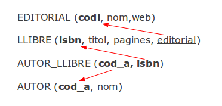
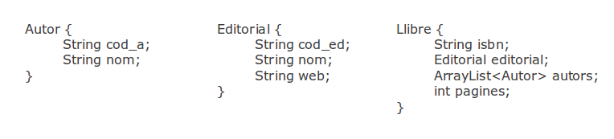

# 2 - El desfasament Objecte-Relacional

Quan necessitem explicar o plasmar una realitat complexa, en compte d'intentar
guardar-la directament, és molt convenient utilitzar un model conceptual més
proper a nosaltres que es comporte de forma similar a la realitat. Es tracta
de plasmar els aspectes essencials i, a la vegada, alleugerir els detalls
insignificants per tal de poder rebaixar la complexitat, i representar-lo
d'una manera propera a nosaltres.

La utilització de models conceptuals durant la implementació d’aplicacions
informàtiques és d’una importància extrema per poder portar a bon termini
qualsevol projecte d’informatització.

El problema és que els models conceptuals són representacions mentals creats a
base d’un procés d’abstracció. I no hi ha una única forma de plasmar-los o
representar-los. Moltes vegades fem servir aproximacions esquemàtiques que
poden estar molt prop de la representació mental, però fins i tot les
representacions esquemàtiques són difícilment representables en la memòria
d’un ordinador.

  * En el cas dels Sistemes Gestors de Bases de Dades Relacionals, primer intentem representar-lo per mig del **Model Entitat-Relació** (que seria el model conceptual que ens permet fer l'aproximació esquemàtica), i després traduïm aquest al Model Relacional (a les taules).
  * Com veurem després, el **Model Orientat a Objectes** intenta representar la realitat per mig d'objectes i les interactuacions que poden haver entre ells. Per tant és un altre model conceptual per a intentar representar la mateixa realitat.

Ens trobem per tant davant de dues maneres de representar la informació, i
inevitablement hi haurà un desfasament. Perquè en les nostres aplicacions
utilitzarem objectes, mentre que en el Model Relacional (on volem guardar la
informació) s'utilitzen taules.

Intentarem explicar aquest desfasament amb uns exemples.

<u>El Model Relacional</u>
========================

El Model Relacional es basa en les taules. En una taula tindrem en les
columnes els distints atributs o característiques que volem representar, i en
les files els distints individus d'aquesta taula.

En totes les taules considerem que tenim una **clau principal** que identifica
unívocament l'individu. En l'exemple el camp **codi** serà la clau principal,
que identifica unívocament cada editorial.

Les diferents taules poden estar relacionades. Si per exemple ens guardem
també els llibres, veuríem que les editorials i els llibres estan
relacionades, concretament un llibre l'ha editat una editorial. Per a marcar
aquest fet el Model Relacional utilitza les **claus externes** (_**foreign
keys**_). Una clau externa és un camp que en una altra taula és clau principal
(la que identifica unívocament). D'aquesta manera, en la taula **LLIBRE**
posarem un camp (per exemple **editorial**) el contingut del qual serà el
codi, qui identifica en l'altra taula, i d'aquesta manera representarem
perfectament l'editorial a la qual pertany el llibre.

Completem un poc més l'exemple anterior, registrant també els autors dels
llibres. Recordem que un llibre pot tenir més d'un autor i un autor pot haver
fet més d'un llibre. Com comentàvem anteriorment, el primer que s'hauria de
fer per tenir un bon disseny és l'esquema en el **Model Entitat-Relació** , i
després traduir-lo al Model Relacional.

Que vol dir que una editorial pot tenir molts llibres editats (però un llibre
només està editat per una editorial). I un llibre pot ser escrit per més d'un
autor, el qual a la seua vegada pot escriure molts llibres.

La traducció al Model Relacional ens donaria no 3 taules, sinó 4. A més de les
taules **EDITORIAL** , **LLIBRE** i **AUTOR** , ens fa falta una altra taula,
anomenada per exemple **AUTOR_LLIBRE** , que és el resultat de la relació M:N
entre **AUTOR** i **LLIBRE**.

Aquest seria l'esquema del Model Relacional:

on hem indicat les claus principals en negreta, i les claus externes amb un
doble subratllat i una fletxa apuntant a la clau principal de l'altra taula.
Observeu que la clau principal de **AUTOR_LLIBRE** és **cod_a + isbn**. A més
cadascuna d'elles és també clau externa que apunta a la taula corresponent.

El Model Relacional també permet definir un conjunt de regles i limitacions en
els valors de les dades i en les accions a realitzar, amb l’objectiu
d’assegurar la consistència de les dades. Així, és possible indicar què s'ha
de fer amb els registres d’una taula que es troben vinculats al registre d’una
segona taula en el moment d’eliminar-lo d'aquesta segona taula. Per exemple,
si eliminem l'autor **aut83** de la taula d'autors, què fem amb les files de
la taula AUTOR_LLIBRE**** que tenen aquest autor? Doncs tres serien les
possibilitats:

  * **NO ACTION** , és a dir, no fer l'acció (no esborrar aut83)
  * **CASCADE** , és a dir, esborrar també les files de AUTOR_LLIBRE en les que estiga aut83.
  * **SET NULL** , és a dir posar a nul el camp en la taula vinculada, però en el nostre exemple aquest ultim cas no és possible, perquè **cod_a** forma part de la clau principal, i per definició cap camp de la clau principal pot agafar el valor nul.

En el cas d'esborrar un autor, a priori sembla que l'opció més correcta seria
la primera, és a dir, no poder esborrar un autor del qual tenim algun llibre
(i per tant tenim alguna fila en la taula AUTOR_LLIBRE amb aquest autor). Però
en cada cas s'ha de mirar quina és l'opció més adequada. Així per exemple,
segurament si esborrem un llibre, podríem perfectament esborrar automàticament
de la taula AUTOR-LLIBRE les files d'aquest llibre (però no esborrar de la
taula AUTOR, clar).

El Model Relacional també permet altres restriccions, com per exemple:

  * definir el rang o conjunt de valors possibles que un camp d’una taula podrà agafar (el que s'anomena com a **domini**),
  * definir un camp com a no nul (per exemple podríem exigir que el camp **nom** de la taula **AUTOR** no puga agafar el valor nul)
  * assegurar la no repetició de determinats camps en diferents registres d’una mateixa taula (per exemple que no es puga repetir el camp nom de la taula EDITORIAL, ja que suposaria tenir dues editorials que es diuen exactament igual). 

<u>Model Orientat a Objectes</u>
==============================

El **Model Orientat a Objectes** és un altre model conceptual que té un punt
de vista diferent al Model Entitat-Relació.

Els **objectes** poden representar qualsevol element del model conceptual, una
entitat, una característica, un procés, una acció, una relació… En els
objectes no únicament intentarem representar les característiques importants
(dades), sinó que també vodrem fer referència al comportament o la
funcionalitat que tindran en el moment de materialitzar-se durant l’execució
de les aplicacions (codi). És a dir, que en un objecte es guarden tant les
dades com les operacions (mètodes) que fem amb aquestes dades, tot junt.

La importància de centrar el model en els objectes és múltiple. Ente els
avantages estan:

  * En referència a les dades, els objectes actuen com estructures jeràrquiques, de manera que la informació queda sempre perfectament contextualitzada dins dels objectes. Així, no té sentit referir-nos a una variable solta. Per exemple, en una aplicació d'una biblioteca el número de pàgines d'un llibre estarà sempre associat (i contingut) a un objecte llibre; igual que el títol, isbn i la resta de dades significatives. Podríem pensar que és igual que en les taules, on els camps o atributs pertanyen a una taula. La diferència, però, es troba en el fet que en el Model Relacional només es manté aquesta relació dins la taula, mentre que en el Model Orientat a Objectes aquesta relació s’estén a tota l’aplicació incorporant-la en el propi codi d’execució.
  * En referència al comportament o la funcionalitat, els objectes delimiten les accions a realitzar sobre les seues dades i sobre la resta d’objectes, definint les regles del joc del que es pot fer durant l’execució de les aplicacions.

El següent dibuix s'intenta explicar aquesta manera de funcionar:

Les figures circulars representen objectes de diferents tipus segons el color.
En el centre dels objectes, els petits cercles representen les dades
encapsulades, inaccessibles de forma directa. Les corones circulars exteriors
representen els mètodes, els quals a petició d’altres objectes (fletxes) poden
consultar o manipular l’estat de l’objecte. Però des de fora no es poden tocar
directament les dades, sempre ha de ser a través dels mètodes que ofereix
l'objecte.

Els valors del conjunt de dades que conformen un objecte en un moment
determinat s’anomena també **estat** , perquè permet descriure l’evolució de
qualsevol objecte durant l’execució d’una aplicació, des del moment de la seua
creació fins que siguen eliminats de la memòria. Per tant, els estats dels
objectes aniran variant al llarg de l'aplicació.

Malauradament, el Model conceptual Orientat a Objectes és un model eminentment
dinàmic que **no contempla** , a priori, la **persistència dels seus
objectes**. Per tant s'ha d'aconseguir poder guardar de forma permanent els
estats dels objectes. S'haurà de portar des d'on estan guardats els objectes
al principi de l'aplicació, inicialitzant-los en l’estat en què es trobaven
quan es van guardar. També s'haurà d'anar guardant periòdicament l’estat dels
objectes a mida que es vagen produint els canvis, de manera que hi haja sempre
una correspondència entre els objectes en memòria i els seus estats
emmagatzemats.

Si pensem en objectes, l'exemple anterior de la biblioteca podria quedar així
(no hem posat els mètodes de cada classe, per centrar-nos en les dades):

Cosa que ens duria a les següents classes:

En aquest exemple, per simplificar, únicament hem plasmat les relacions entre
classes a la classe **Llibre** , posant la referència a l'objecte
**Editorial** al qual pertany el llibre, i un **ArrayList d'Autors** , on
estarà la llista dels autors del llibre. En realitat, per a una major
comoditat a l'hora de programar, el més lògic seria posar també en
**Editorial** un **ArrayList <Llibre>** que arreplegue tots els llibres de
l'editorial, i en **Autor** posaríem un **ArrayList <Llibre>** amb tots els
llibres de l'autor. Però no les hem posades per fer l'exemple més senzill.

<u>El Desfasament Objecte-Relacional</u>
=======================================

Si ens plantegem guardar els **objectes** d’una aplicació en un SGBD
**Relacional** , el principal problema que trobarem és que es tracta de
conceptes diferents, els objectes i les taules, i estan centrats en aspectes
també diferents. El Model Entitat-Relació (que tindrà una traducció directa al
Model Relacional) es troba fortament centrat en les dades i en l’estructura
que cal donar a aquestes dades per poder guardar-les i recuperar-les. En canvi
el Model Orientat a Objectes es troba centrat en els objectes, entesos com a
agrupacions de dades i també com a un conjunt de processos de canvi, que
afecten aquestes dades.

El Model Relacional necessitarà sempre certa quantitat d’informació extra
destinada a mantenir les relacions i la coherència de les dades. Les claus
externes són l’exemple més clar. Es tracta d’informació afegida en alguns
registres per tal de vincular-los a uns altres. Així per exemple, per a saber
el llibre de quina editorial és, afegim la clau externa que apunte a la taula
Editorial, que serà un camp en la taula Llibre on es guardarà la clau
principal de l'editorial a la qual pertany (per això es diu clau externa).

La vinculació entre objectes, en canvi, s’aconsegueix de forma estructural. No
es necessiten dades extra, sinó que la mateixa estructura de dades defineix la
vinculació, la visibilitat, l’accés, etc. Per exemple, per a guardar
l'editorial d'un llibre, no guardem la seua clau principal com una clau
externa en el llibre, sinó que guardem una referència a la mateixa editorial,
a l'objecte editorial.

Aquestes diferències constitueixen el que en el món de la programació es
coneix com a ** _desfasament objecte-relacional_**. Aquest desfasament ens
obliga, quan decidim treballar conjuntament amb els dos models, un SGBD
Relacional per a guardar les dades i un llenguatge Orientat a Objectes com per
exemple Java o Kotlin, a codificar implementacions extres que funcionen a mode
d’adaptadors. És a dir que hem de _**convertir**_ o _**transformar**_ els
objectes en taules i a l'inrevés.

Mirem l'exemple comentat tant en el Model Relacional com en l'Orientat a
Objectes: la biblioteca. Hi ha evidents diferències en guardar les coses d'una
o altra manera.

**Les diferències més clares són:**

  * La manera d'indicar l'editorial del llibre, en objectes és posar una referència a l'editorial, mentre que en el Model Relacional posem una clau externa. Quan anem a guardar les dades, s'haurà de substituir l'objecte editorial per la clau principal de l'editorial. I quan recuperem, serà el procés invers, hauríem d'utilitzar la clau externa per agafar l'editorial i guardar aquest objecte en l'objecte llibre.
  * Més complicada és la manera d'indicar els autors del llibre. Com pot haver més d'un autor per llibre, en objectes posem un ArrayList de tipus Autor, mentre que en el Model Relacional hem de posar una nova taula. Guardar les dades d'un llibre suposarà en la pràctica guardar en dues taules, LLIBRE i AUTOR_LLIBRE. Les dades de LLIBRE es poden guardar directament, i les de AUTOR_LLIBRE suposarà un bucle per a recórrer l'ArrayList i fer una operació d'escriptura (INSERT) en AUTOR_LLIBRE per cada autor de la llista. A l'inrevès també haurem de fer un bucle, recorrent totes les files dels autors del llibre en qüestió, per a anar inserint en l'ArrayList.

També haurem de tenir present que el Model Relacional disposa d’un conjunt de
llenguatges (DDL, DCL, SQL, etc.) adequats per explotar al màxim els SGBD
tenint en compte les característiques relacionals, i així poder crear les
taules (CREATE TABLE), inserir les dades (INSERT) i recuperar-les (SELECT),
mentre que en la programació Orientada a Objectes es treballa bàsicament amb
llenguatges de programació imperatius. Haurem d'incorporar per tant les
sentències de SQL (i DDL, ...) dins del llenguatge amfitrió orientat a
objectes (per exemple Java o Kotlin).

Un altre exemple de desfasament el trobem també en els resultats recuperats
des d’un SGBD. Aquestos s’obtenen sempre en un format tabular i, per tant,
caldrà implementar utilitats que transformen les seqüències de dades simples
en estats dels objectes de l’aplicació, com havíem vist en l'exemple de la
biblioteca.

Llicenciat sota la  [Llicència Creative Commons Reconeixement CompartirIgual
2.5](http://creativecommons.org/licenses/by-sa/2.5/)

