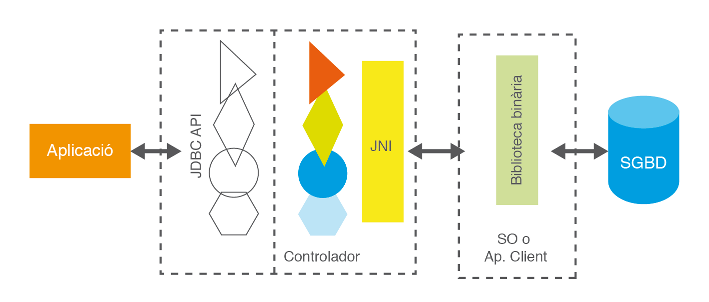

# 3 - Connexió a les BD: Connectors

Deixem de banda de moment el desfasament Objecte-Relacional i centrem-nos ara
en l'accés a Base de Dades Relacionals des dels llenguatges de programació. Ho
raonarem en general i ho aplicarem a Java-Kotlin.

Des de la dècada dels 80 que existeixen a ple rendiment les Bases de Dades
Relacionals. Quasi tots els Sistemes Gestors de Bases de Dades (excepte els
més xicotets com Access, Base de LibreOffice o SQLite) utilitzen
l'arquitectura client-servidor. Això vol dir que hi ha un ordinador central on
està instal·lat el Sistema Gestor de Bases de Dades Relacional que actua com a
servidor, i hi haurà molts clients que es connectaran al servidor fent
peticions sobre la Base de Dades.

Els Sistemes Gestors de Bases de Dades inicialment disposaven de llenguatges
de programació propis per a poder fer els accesos des dels clients. Era molt
consistent, però a base de ser molt poc operatiu:

  * L'empresa desenvolupadora del SGBD havia de mantenir un llenguatge de programació, que resultava necessàriament molt costós, si no volien que quedara desfasat.
  * Les empreses usuàries del SGBD, que es connectaven com a clients, es trobaven molt lligades al servidor per haver d'utilitzar el llenguatge de programació per accedir al servidor, cosa que no sempre s'ajustava a les seues necessitats. A més, el plantejar-se canviar de servidor, volia dir que s'havien de re-fer tots els programes, i per tant una tasca de moltíssima envergadura.

Per a poder ser més operatius, calia desvincular els llenguatges de
programació dels Sistemes Gestors de Bases de Dades utilitzant uns estàndars
de connexió.

## 3.1 - ODBC

A mida que les teories de dades relacionals anaven agafant força i les xarxes
guanyaven adeptes gràcies a l’increment de l’eficiència a preus realment
competitius, van començar a implementar-se uns Sistemes Gestors de Bases de
Dades basats en la tecnologia client-servidor, que van triomfar.

La tecnologia client-servidor va permetre aïllar les dades i els programes
específics d’accés a aquestes dades, del desenvolupament de l’aplicació. La
raó principal d’aquesta divisió va ser segurament possibilitar l’accés remot a
les dades de qualsevol ordinador connectat a la xarxa. El cert, però, és que
aquest fet va empènyer els Sistemes de Bases de Dades a desenvolupar-se d’una
forma aïllada i a crear protocols i llenguatges específics per poder-se
comunicar remotament amb les aplicacions que corrien en els clients. Per dir-
lo d'alguna manera, havien de desenvolupar els servidors i també els clients,
per a poder connectar-se amb el servidor.

A poc a poc, el software al voltant de les bases de dades va créixer
espectacularment intentant donar resposta a un màxim de demandes a través de
sistemes altament configurables. És el que avui dia es coneix com a
_middleware_ o capa intermèdia de persistència. És a dir, el conjunt
d’aplicacions, utilitats, biblioteques, protocols i llenguatges, situats tant
a la part servidor com a la part client, que permeten connectar-se remotament
a una base de dades per configurar-la o explotar-ne les seues dades.

<u>L'arribada dels estàndards</u>
================================

Inicialment, cada empresa desenvolupadora d’un SGBD implementava les seues
solucions específiques per al seu sistema, però prompte es van donar compte
que col·laborant conjuntament podien treure’n major rendiment i avançar molt
més ràpidament.

Sostenint-se en el Model Relacional i en algunes implementacions primerenques
de les empreses IBM i Oracle, es va desenvolupar el llenguatge de consulta de
dades anomenat **SQL**(_**Structured Query Language**_). Va ser un gran pas
endavant, perquè s'uniformava la manera d'accedir a la BD, però les
aplicacions necessitaven API amb funcions que permeteren fer crides des del
llenguatge de desenvolupament per enviar les consultes SQL.

Cada SGBD té la seua pròpia connexió i el seu propi API.

El grup anomenat _SQL Access Group_, en el qual participaven prestigioses
empreses del sector com Oracle, Informix, Ingres, DEC, Sun o HP, va definir un
API universal amb independència del llenguatge de desenvolupament i la Base de
Dades a connectar.

El 1992, Microsoft i Simba implementen l’**ODBC** (_**Open Data Base
Connectivity**_), un API basat en la definició del _SQL Acces Group_, que
s’integra en el sistema operatiu de Windows i que permet afegir múltiples
**connectors** (o **controladors** o _**Drivers**_) a diverses Bases de Dades
Relacionals (que utilitzen SQL) de forma molt senzilla i transparent, ja que
els connectors són autoinstal·lables i totalment configurables des de les
mateixes eines del Sistema Operatiu. D'aquesta manera, tenint instal·lat ODBC
(i en Windows acabarà venint instal·lat per defecte), les aplicacions es
connectaran a través d'ODBC a qualsevol dels SGBD del qual tinguem instal·lat
el connector. Per a connectar a una Base de Dades o una altra, només hem de
canviar de controlador, sense haver de canviar la pròpia aplicació.

L’arribada de l’ODBC va representar un pas sense precedents en el camí cap a
la interoperabilitat entre bases de dades i llenguatges de programació. La
majoria d’empreses desenvolupadores de Sistemes Gestors de Bases de Dades van
proporcionar els _drivers_ de connectivitat, i els llenguatges de programació
més importants van desenvolupar biblioteques específiques per suportar l’API
ODBC.

<u>La situació actual</u>
========================

Actualment, ODBC continua sent una adequada manera de connectar als SGDB
Relacionals. El seu desenvolupament segueix liderat per Microsoft, però
existeixen versions per a altres Sistemes Operatius com UNIX/LINUX o MAC. Els
llenguatges més populars de desenvolupament mantenen actualitzades les
biblioteques de comunicació amb les successives versions que han anat
apareixent i la majoria de SGBD disposen d’un controlador ODBC bàsic. I per
tant la connexió queda garantida.

Actualment, l’ODBC s’estructura en tres nivells. El primer, anomenat _core
API_, és el nivell més bàsic corresponent a l’especificació original (basada
en el _SQL Access Group_). El _Level 1 API_ i el _Level 2 API_ afegeixen
funcionalitats avançades, com cridades a procediments guardats en el Sistema
Gestor de Bases de Dades, aspectes de seguretat d’accés, definició de tipus
estructurats, etc.

En realitat, l’ODBC és una especificació de baix nivell, és a dir, de funcions
bàsiques que possibiliten la connexió, que asseguren l’atomicitat de les
peticions, el retorn d’informació, el capsulament del llenguatge de consulta
SQL o l’obtenció de dades aconseguides en resposta a un petició.

La funcionalitat de baix nivell fa que es puga adaptar a moltes aplicacions;
això sí, a costa d’un considerable nombre de línies de codi necessàries per
adaptar-se a la lògica de cada aplicació. És per això que sobre la base de
l’ODBC han sorgit altres alternatives de persistència de més alt nivell. Per
exemple, Microsoft ha desenvolupat OLE DB o ADO.NET. Aquest últim possibilita
ja els objectes per a qualsevol tipus d’aplicació basada en la plataforma
.NET.

## 3.2 - JDBC

Pràcticament de forma simultània a ODBC, l’empresa Sun Microsystems, l’any
1997 va treure a la llum **JDBC** (_**Java DataBase Connectivity**_), un API
connector de bases de dades, implementat específicament per a utilitzar amb el
llenguatge Java. Es tracta d’un API molt similar a ODBC quant a la manera de
funcionar:

  * Tindrem l'API JDBC que utilitzaran les aplicacions que vulguen connectar a les Bases de Dades, i que garatitza una uniformitat, siga quina siga la o les Bases de Dades a connectar
  * Ens farà falta un **controlador** o _**driver**_ per cada Base de Dades a la qual vulguem connectar

Però com comentàvem, està adaptat específicament per a Java. És a dir, la
funcionalitat es troba encapsulada en classes (ja que Java és un llenguatge
totalment orientat a objectes) i a més, no depèn de cap plataforma especifica,
d’acord amb la característica multiplataforma defensada per Java.

Aquest connector serà l’API que estudiarem en detall en aquesta unitat, ja que
Java no disposa de cap biblioteca específica ODBC. Les raons esgrimides per
_Sun_ són que ODBC no es pot fer servir directament en Java ja que està
implementat en C i no és orientat a objectes.

Però, per a no perdre la potencialitat de les connexions ODBC, que recordem
que ens permetia connectar a qualsevol Base de Dades Relacional, Sun
Microsystem ha optat per incorporar de sèrie un _driver_ especial que actua
d’adaptador entre l’especificació JDBC i l’especificació ODBC. Aquest
controlador s’acostuma a anomenar també **pont JDBC-ODBC** (_bridge_ en
anglès). Utilitzant aquest _driver_ podrem enllaçar qualsevol aplicació Java
amb qualsevol connexió ODBC.

Actualment, la gran majoria d’SGBD disposen de _drivers_ JDBC, però en cas
d’haver de treballar amb un sistema que no en tinga, si disposa de controlador
ODBC, podrem fer servir el pont JDBC-ODBC per aconseguir la connexió des de
Java.

<u>Arquitectura JDBC</u>
=======================

  * La biblioteca estàndard **JDBC** conté un gran nombre d’interfícies _sense_ les classes que les implementen.
  * Els controladors o drivers dels SGBD concrets (i que els proporciona el fabricant del SGBD) són els que han d'implementar les interfícies anteriors i així accedir a les seues dades amb les particularitats que puga tenir el SGBD en concret.

Des de les aplicacions s'utilitzaran les interfícies de JDBC, i d’aquesta
manera, el controlador utilitzat serà totalment transparent a l’aplicació.

D’aquesta manera s’aconsegueix independitzar l’aplicació dels controladors
permetent la substitució del controlador original per qualsevol altre
compatible JDBC sense pràcticament necessitat d’haver de modificar el codi de
l’aplicació.

_D'una banda trobem les interfícies definides a l'estàndard (les figures amb
fons transparent). Es tracta de l'API amb el que l'aplicació treballarà de
forma directa._

_De l'altra banda trobem les classes específiques del controlador (driver) que
interaccionen amb el SGBD i que implementen les interfícies de l'estàndard
JDBC. Són les figures amb fons de diferents colors  
_

És important destacar que JDBC no exigeix cap instal·lació, ni cap canvi
substancial en el codi a l’hora de fer servir un o altre controlador. I fins i
tot podrem utilitzar més d'un controlador per a poder connectar des de la
mateixa aplicació a més d'un SGBD. Això és possible perquè:

  * Java permet carregar en memòria qualsevol classe a partir del seu nom, i així carregar el o els controladors que necessitem. Es fa amb la sentència **Class.forName** (“nom_de_la_Classe”).
  * La classe **DriverManager** (de l’API JDBC) és capaç de seleccionar el driver adequat d'entre tots els que estiguen carregats en memòria, sense necessitat d’indicar-li el _driver_ específic que cal fer servir.

<u>Tipus de controladors</u>
============================

JDBC distingeix quatre tipus de controladors:

**1.** **Tipus I**. Controladors **pont** (_bridge driver_) com JDBC-ODBC. Es
caracteritzen per fer servir una tecnologia externa a JDBC i actuar
d’adaptador entre les especificacions de l’API JDBC i la tecnologia concreta
utilitzada. El més conegut és el controlador **pont JDBC-ODBC** , però n’hi ha
d’altres, com JDBC-OLE DB. La seua principal raó de ser és la de permetre
utilitzar l'altra tecnologia (ODBC) que està molt estesa i assegurar així la
connexió amb pràcticament qualsevol font de dades. Cada client:

  * Haurà de tenir instal·lada una utilitat de gestió i configuració de fonts de dades ODBC (o de la tecnologia utilitzada)
  * Haurà de tenir instal·lat el _driver_ ODBC específic del’SGBD al qual es vol accedir
  * A través de la primera utilitat crear un DSN (Data Source Name) que utilitze el driver del SGBD amb les dades de connexió al SGBD

Com que la connexió és a través de ODBC (no directament) pot donar problemes
de rendiment i, per tant, s’aconsella fer servir aquest tipus de controlador
només com a última alternativa.

**2. Tipus II**. Controladors de **Java amb API parcialment nadiu** (_Native-
API partly Java driver_). S’anomenen també simplement _nadius_. Com el seu nom
indica, estan formats d’una part codificada en Java i una altra part que usa
biblioteques binàries instal·lades en el sistema operatiu. Aquest tipus de
controladors existeixen perquè alguns Sistemes Gestors de Bases de Dades tenen
entre les seues utilitats de sèrie connectors propis. Solen ser connectors
propietaris que no segueixen cap estàndard, ja que acostumen a ser anteriors a
ODBC o JDBC, però es mantenen perquè solen estar molt optimitzats i són molt
eficients. Utilitzant una tecnologia Java anomenada JNI és possible
implementar classes, els mètodes de les quals invoquen funcions de
biblioteques binàries instal·lades en el sistema operatiu. Els controladors de
tipus II utilitzen aquesta tecnologia per crear les classes implementadores de
l’API JDBC. En alguns casos pot requerir una instal·lació extra de certes
utilitats a la part client, exigides pel connector nadiu del sistema gestor.

**3. Tipus III**. Controladors de **Java via protocol de xarxa**. Es tracta
d’un controlador escrit totalment en Java que tradueix les cridades JDBC a un
protocol de xarxa contra un servidor intermedi (anomenat normalment
_Middleware_) que pot estar connectat a diversos SGBD. Aquest tipus de
_driver_ presenta l’avantatge que utilitza un protocol independent dels SGBD
i, per tant, el canvi de font de dades es pot fer de manera totalment
transparent als clients. Això el converteix en un sistema molt flexible,
encara que per contra, es necessitarà instal·lar, en algun lloc accessible de
la xarxa, un servidor intermedi connectat a tots els SGBD que calga. Aquest
tipus de controladors són molt útils quan hi ha un número molt gran de
clients, ja que els canvis d’SGBD no requeriran cap canvi en els clients, ni
tan sols la incorporació d’una nova biblioteca.

**4 Tipus IV**. Controladors de tipus **Java pur** o **Java 100%**.
S’anomenen també controladors de _protocol nadiu_. Són controladors escrits
totalment en Java. Les peticions al Sistema Gestor de Bases de Dades es fan
sempre a través del protocol de xarxa que utilitza el propi SGBD i, per tant,
no es necessita ni codi nadiu en el client (com en el cas del tipus II) ni
servidor intermedi (com en el cas del tipus III) per connectar amb la font de
dades. Es tracta, doncs, d’un _driver_ que no requereix cap tipus
d’instal·lació ni requeriment, la qual cosa el fa ser una alternativa molt ben
considerada que en els últims temps ha acabat imposant-se. De fet, la major
part de fabricants ha acabat creant un controlador de tipus IV, tot i que
segueixen mantenint també els dels altres tipus.

Els tipus desitjables són el tipus III i sobretot el **tipus IV** , ja que
d'aquesta manera no ens fa falta instal·lar res per a poder connectar.

En aquest tema intentarem connectar a 4 Sistemes Gestors de Bases de Dades
diferents: **PostgreSQL** , **Oracle** , **MySQL** i **SQLite**

Els drivers o controladors (tots de tiups IV) us els podeu baixar sense
problemes. Són fàcils de trobar, únicament amb un buscador posar **jdbc** i el
Sistema Gestor de Bases de Dades (per exemple **jdbc postgresql**). De tota
manera, per més comoditat, teniu **una carpeta en el curs de Aules amb tots
els drivers** que ens fan falta.

Llicenciat sota la  [Llicència Creative Commons Reconeixement CompartirIgual
2.5](http://creativecommons.org/licenses/by-sa/2.5/)

