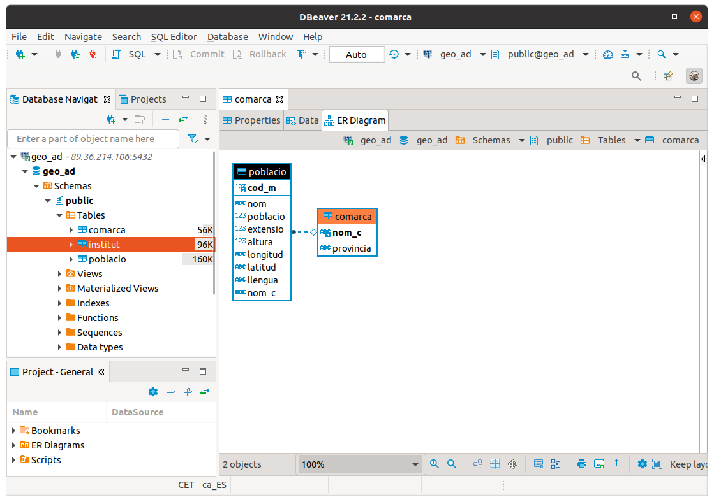
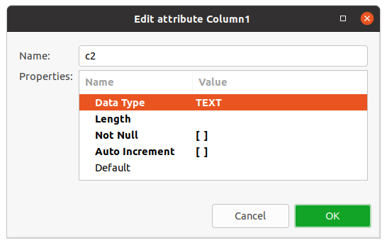

# 4 - "Tocar" les dades

Abans de començar a treballar la persistència en diferents Bases de Dades
Relacionals, ens convindrà accedir al Sistema Gestor de Base de Dades per a
poder veure les dades, treballar amb elles.

Bàsicament voldrem:

  * Poder veure les taules de la Base de Dades
  * Poder veure l'estructura de cada taula: camps, tipus dels camps, clau principal, ...
  * Poder veure les dades d'una taula, fins i tot poder indroduir noves files, esborrar o modificar de forma còmoda
  * Poder editar i executar sentències SQL de forma còmoda

L'entorn d'IntelliJ ens proporciona una eina ja instal·lada, **Database** , a
la qual es pot accedir des de **View - > Tool windows -> Database**. És una
bona manera de poder connectar i "tocar" les dades sense tenir un client
específic del Sistema Gestor de Base de Dades al qual volem accedir.

Però està clar que si disposem d'un client específic del SGBD, serà més còmode
que amb la perspectiva anterior. Per això veurem una eina que ens permet
connectar a quasi tots els Sistemes Gestors de Bases de Dades Relacionals, i
per tant amb una única eina podem connectar on vulguem. És el **DBeaver**.

## 4.1 - Des de IntelliJ

Des dels programes Java o Kotlin podríem connectar ja mateix a les diferents
BD amb els connectors JDBC, però abans ens faria falta poder veure les taules
amb les dades i fins i tot administrar aquestes Bases de Dades.

Això es pot fer des d'IntelliJ sense molt fàcilment, ja que en la nostra
versió ho tenim integrat per defecte. Utilitzarem els connectors (drivers)
JDBC, per a connectar a les Bases de Dades, però d'una forma independent dels
projectes. La manera d'accedir és:

**Wiew -- > Tool Windows --> Database**

i se'ns obrirà una subfinestra a la dreta per a poder "treballar" amb les
Bases de Dades


Des d'aquesta finestra podrem controlar les connexions a Bases de Dades i
també els Drivers JDBC que ens permeten connectar. Com hem comentat serà
independent dels projectes Java o Kotlin

**<u>Connexió a PostgreSQL</u>**


Com a primer exemple de connexió, intentarem connectar a PostgreSQL. Farà
falta especificar:

  * Les dades de connexió, que seran: 
    * Servidor (host): **89.36.214.106**
    * Port: **5432** (és el port per defecte)
    * Usuari: **geo_ad**
    * Contrasenya: **geo_ad**
    * Base de dades: **geo_ad**
  * En el moment que demana pel controlador (driver) de PostgreSQL, apretar a baixar. Serà un de tipus IV. Açò només serà necessari la primera vegada que connectem a PostgreSQL.

    <iframe src="https://slides.com/aliciasalvador/ad_t4_connexipostgresql/embed" width="576" height="420" title="Copy of AD_T4_ConnexiPostgreSQL" scrolling="no" frameborder="0" webkitallowfullscreen mozallowfullscreen allowfullscreen></iframe>

De la configuració anterior podem observar la **URL** de connexió que va a
continuació. És important, perquè després quan connectem des dels nostres
programes Java, haurem d'especificar-la també. Haurem de substituir
_servidor_ per l'adreça IP o el nom del servidor, la  _base_de_dades_ per la
base de dades a la qual ens volem connectar.

**URL de PostgreSQL**

```
  jdbc:postgresql://_servidor_ :5432/_base_de_dades
```
  que en el nostre exemple ha quedat:
```
  jdbc:postgresql://89.36.214.106:5432/geo_ad
```
**<u>Connexió a MySQL</u>**


Repetim el procés per a MySQL. El servidor està en la mateixa màquina que
PostgreSQL (89.36.214.106). L'usuari amb que connectarem ara es diu
**factura**. Haurem d'especificar:

  * Les dades de connexió, que seran: 
    * Servidor: **89.36.214.106**
    * Port: **3306**
    * Usuari:**factura**
    * Contrasenya: **factura**
    * Base de dades: **factura**
  * Quan demane pel controlador (driver) de MySQL, haurem d'apretar a baixar. Açò només serà necessari la primera vegada que connectem a MySQL
  
      <iframe src="https://slides.com/aliciasalvador/ad_t4_connexiomysql/embed" width="576" height="420" title="Copy of AD_T4_ConnexioMySQL" scrolling="no" frameborder="0" webkitallowfullscreen mozallowfullscreen allowfullscreen></iframe>


**URL de MySQL**
```
jdbc:mysql://_servidor_ :3306/_base_de_dades
```
que en el nostre exemple queda:
```
jdbc:mysql://89.36.214.106:3306/factura
```
**<u>Connexió a SQLite</u>**


SQLite és un SGBD molt diferent als anteriors. En tots els anteriors
s'utilitza l'arquitectura client-servidor. I per tant el servidor de Base de
Dades no té per què estar en la mateixa màquina.

Però en moltes ocasions ens pot venir bé un SGBD molt més xicotet i senzill
que guarde la BD en la mateixa màquina, que siga monousuari i que pese molt
poc.

SQLite és un SGBD multiplataforma (podrem fer-lo rodar en qualsevol
plataforma) que és molt lleuger. Admet la major part de l'estàndar SQL-92. I
guarda una Base de Dades en un únic fitxer. Una altra característica és que
des de Java o Kotlin, amb el driver JDBC podrem accedir a les Bases de Dades
SQLite sense que faça falta cap motor de Base de Dades. Per tant és ideal com
a Base de Dades que puguem copiar a les nostres aplicacions.

Quan connectem des de IntelliJ ara no caldrà especificar on està el servidor
ni quin usuari s'ha de connectar. Haurem de dir el fitxer amb la ruta on està
(o estarà) la Base de Dades. Per tant només haurem d'especificar:

  * Les dades del fitxer: ruta i nom. La ruta ha d'existir. Si el fitxer no existeix, el crearà.
  * Quan ens diga baixarem el Driver. Això només ens caldrà la primera vegada que connectem amb SQLite

    <iframe src="https://slides.com/aliciasalvador/ad_t4_connexiosqlite/embed" width="576" height="420" title="Copy of AD_T4_ConnexioSQLite" scrolling="no" frameborder="0" webkitallowfullscreen mozallowfullscreen allowfullscreen></iframe>

**URL de SQLite**
```
jdbc:sqlite:ruta_del_fitxer_sqlite
```


Com hem comentat, SQLite és més senzill que els altres SGBD. Concretament, els
tipus de dades que utilitza són:

  * **INTEGER**. El valor és un enter amb signe, que ocupa 1, 2, 3, 4, 6, o 8 bytes depenent de la grandària del valor.

  * **REAL**. El valor és un número real en coma flotant que ocupa 8 bytes (doble precisió).

  * **TEXT**. El valor és una cadena de caràcters que pot estar codificada en UTF-8, UTF-16BE o UTF-16LE, depenent de la codificació de la Base de Dades. No ens preocuparem de la codificació interna.

  * **BLOB**. Per a guardar dades binàries que es guardaran exactament com entren, sense mirar el format.

Des de l'entorn d'IntelliJ podrem visualitzar les taules i fins i tot crear-
les, amb SQL.


## 4.2 - DBeaver

Ja hem vist la utilitat d'inspeccionar les Bases de Dades que ens proporciona
IntelliJ, i que ens permet accedir a les Bases de Dades per veure l'estructura
i les dades de les taules, fins i tot, fer i executar sentències SQl. Però no
és excessivament còmoda.

Els Sistemes Gestors de Bases de Dades tenen clients específics per a poder
treballar amb les seues Bases de Dades.

Però hi ha un altre software, lliure, anomenat **DBeaver** que ens permet
connectar a quasi totes les Bases de Dades Relacionals, i fins i tot a moltes
BD NoSQL en la seua versió comercial (Enterprise Edition). Nosaltres
utilitzarem la que sí que és de codi obert, la Community Edition.

Ens ho podem baixar des de la seua pàgina de descàrregues,
<https://dbeaver.io/download>. En el moment de fer aquestos apunts van per la
versió 24.2.2


La seua instal·lació no ofereix cap dificultat. En concret, per a Ubuntu, ens
ofereix un paquet Debian, que senzillament hem d'instal·lar com a superusuari.

Aquest és el seu aspecte:


Anem a crear una connexió a PostgeSQL, una altra a MySQL i una altra a SQLite.

Quan creem una nova connexió ja podem veure que es pot fer a molts SGBD. En la
primera pantalla ja tenim els 3 que volem nosaltres, però hi ha molts més


Quan li faça falta un Driver (que per cert seran drivers JDBC) ens preguntarà
de baixar-lo automàticament, per tant serà comodíssim.

**<u>PostgreSQL</u>**


Aquestes són les dades de connexió que farem:

  * Nom de la connexió: el que vulguem, per exemple **geo_ad**
  * Host: **89.36.214.106**
  * Port: **5432** (és el port per defecte)
  * Database: **geo_ad**
  * Usuari: **geo_ad**
  * Contrasenya: **geo_ad**
  * I en la pestanya **PostgreSQL** cuidem de **no tenir seleccionada l'opció Show all databases** , ja que és inútil mostrar Bases de Dades a les quals no tindrem accés

 |   
---|---  
  
Una vegada creada la connexió podrem navegar fins les taules, i en seleccionar
una veurem en 3 pestanyes l'estructura, les dades, i fins i tot un esquema de
l'estil del Model Entitat-Relació (encara que en realitat representa el Model
Relacional) on intervé la taula, és a dir, ens mostra les seues claus
externes.

 |   | 
---|---|--- 
  
Finalment observem com també podem executar sentències SQL de forma molt
còmode, i on ens dóna molta ajuda per escriure correctament les paraules
reservades i també les taules i camps de la nostra BD


**<u>MySQL</u>**


  * Nom de la connexió: el que vulgueu, per exemple **Connexio MySQL factura**
  * Servidor: **89.36.214.106**
  * Port: **3306**
  * Base de dades: **factura**
  * Usuari: **factura**
  * Contrasenya: **factura**


La seua utilització és igual de fàcil que en l'anterior cas.


**<u>SQLite</u>**


La connexió a SQLite és més senzilla i per tant ens preguntarà menys coses:

  * Nom de la connexió
  * Ruta i nom del fitxer


L'entorn serà totalment similar als dels casos anteriors. Però en aquesta Base
de Dades de prova, proveta.sqlite no teníem cap taula:


Aprofitem per a crear una taula, per veure que és molt fàcil i còmode. Crearem
una taula T1 amb 2 camps, c1 numèric, i c2 de text.

Potser el menys intuïtiu és la manera de crear els camps de la taula. Serà
apretant amb el botó de la dreta en la zona de les columnes.


En les següents imatges es veu com es creen 2 camps. La tercera és en el
moment de guardar la taula, i podem comprovar que el que fa és generar una
consulta SQL

 |  |   
---|---|---

Llicenciat sota la  [Llicència Creative Commons Reconeixement CompartirIgual
2.5](http://creativecommons.org/licenses/by-sa/2.5/)

