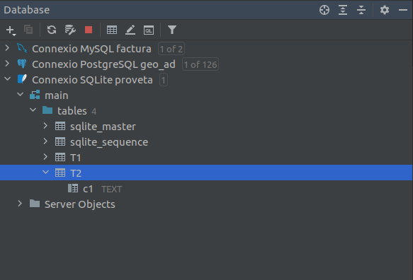

# 5 - Iniciació a l'API JDBC

Ara veurem els elements bàsics de l’API JDBC que permeten a les aplicacions
Java o Kotlin comunicar-se amb un SGBD fent servir el llenguatge SQL. Cal que
disposeu del connector **JDBC** dels 3 SGDB que anem a utilitzar:
**PostgreSQL** , **MySQL** i **SQLite**. Afegirem els 3 connectors a les
biblioteques del projecte.**** També serà necessari connectar des de IntelliJ
amb la utilitat que ens ofereix per a veure les Bases de Dades: **View - >
Tool Windows -> Database**, si no disposeu del **DBeaver** (o clients
espacífics de cada SGBD).

Els drivers JDBC per als distints SGBD són molt fàcils de trobar, fent una
senzilla recerca de **driver JDBC download** i el SGBD que vulgueu. Per més
comoditat us pose ací els enllaços:

  * PostgreSQL: <https://jdbc.postgresql.org/download/postgresql-42.2.24.jar>
  * MySQL: <https://jar-download.com/artifacts/mysql/mysql-connector-java>
  * SQLite: <https://jar-download.com/artifacts/org.xerial/sqlite-jdbc>

També teniu, per més comoditat, una carpeta en el curs de Moodle amb tots els
drivers que ens fan falta

Per tal de poder practicar la connexió i accedir a les dades, tenim una Bases
de Dades de prova en cada SGBD:

  * PosgreSQL: **geo_ad** (contrasenya: **geo_ad**)
  * MySQL: **factura** (contrasenya: **factura**)
  * SQLite: **proveta.sqlite** , però en realitat crearem les Bases de Dades que ens facen falta

Crearem un projecte nou anomenat **Tema4** , per exemple, i li afegirem els
**controladors JDBC** de **PostgesSQL** , **MySQL** i **SQLite** com a
biblioteca del projecte. Per a separar les proves dels exercicis, ens creem un
**paquet** anomenat **exemples**.

En la següent imatge es veu com hem incorporat els drivers al projecte (es fa
sobre el projecte **F4 - > Modules -> Dependencies**)


En els punts següents anem a comentar cada cosa per separat, pas a pas. De
tota manera, posem la llista inicial de classes que utilitzarem per a poder
connectar i accedir a la Base de Dades:

Classe | Descripció  
---|---  
**Driver** | Permet connectar a una Base de Dades   
**DriverManager** | Permet gestionar tots els drivers instal·lats al sistema  
**Connection** | Representa una connexió amb una BD. En una aplicació pot haver més d'una connexió  
**Statement** | Permet executar sentències SQL sense paràmetres  
**PreparedStatement** | Permet executar sentències SQL amb paràmetres  
**ResultSet** | Conté les files resultants d'executar una sentència SELECT  
**DatabaseMetadata** | Proporciona informació d'una BD, com per exemple les taules que conté  
**ResultSetMetadata** | Proporciona informació sobre un ResultSet: número de columnes, noms de les columnes, tipus, ...  
  
## 5.1 - Establiment de la connexió

Un objecte de la classe **Connection**(de l'API JDBC) representarà una
connexió a la Base de Dades d'un determinat SGBD. Haurem de tenir el
controlador del SGBD inclós en el projecte.

L'objecte **Connection** l'obtindrem a partir del **DriverManager** , que
havíem comentat que és capaç de gestionar tots els drivers carregats en
memòria. El mètode que utilitzarem del **DriverManager** és el
**getConnection(_url_ ,_usuari_ ,_password_)**, on li passarem les dades de
connexió a la Base de Dades d'aquesta manera:

  * **URL** : cadena de connexió seguint el protocol JDBC. Comença sempre per **jdbc** , el nom del SGBD (separat per dos punts), i la manera d'arribar a la BD, també separat per 2 punts. Aquesta manera d'arribar a la BD dependrà del controlador del SGBD, però d'alguna manera harem d'especificar el _servidor_ , el _port_ de connexió i el nom de la BD o esquema a connectar.
  * **Usuari** i **contrasenya** : encara que en alguns SGBD (com per exemple SQLite) no seran necessaris.

Aquestes són les **_url_** que utilitzarem:

  * **PostgreSQL** : per connectar-nos al servidor situal a l'adreça **89.36.214.106** , que escolta el port per defecte (**5432**), i a la Base de Dades anomenada **geo_ad** , la cadena serà:
```
jdbc:postgresql://89.36.214.106:5432/geo_ad
```
  * **MySQL** : el servidor és el mateix de PostgreSQL, el port per defecte és 3306, i si volem connectar a la Base de Dades **factura** :
```
jdbc:mysql://89.36.214.106:3306/factura
```
  * **SQLite** : no haurem d'especificar ni servidor ni port (ni posteriorment usuari ni contrasenya); únicament el nom del fitxer amb la ruta. Si volem connectar a la Base de Dades situada en el directori **/home/usuari/BD_SQLite** , i anomenada **proveta.sqlite** :
```
jdbc:sqlite:/home/usuari/BD_SQLite/proveta.sqlite
```
__

Mirem tres exemple de connexió, un per a cada Base de Dades de prova que tenim
en els diferents SGBD que ens hem plantejat connectar. Observeu com només hem
canviat la **URL** , a banda de l'usuari i contrasenya, clar (en SQLite no hi
haurà). I el millor de tot és que una vegada feta la connexió, farem el mateix
tractament siga quin siga el SGBD al qual ens hem connectat, com veurem amb
posterioritat.

En aquestos exemples, tan sols fem la connexió. Si no es produeix cap error és
que s'ha pogut connectar.

  * **PostgreSQL**

Guardeu el següent codi en un fitxer Kotlin anomenat
**Exemple_4_1_ConnexioPostgreSQL.kt** :

    
    
    package exemples
    
    import java.sql.DriverManager
    
    fun main(args: Array<String>) {
        val url = "jdbc:postgresql://89.36.214.106:5432/geo_ad"
        val usuari = "geo_ad"
        val password = "geo_ad"
    
        val con = DriverManager.getConnection(url, usuari, password)
        System.out.println("Connexió completada")
        con.close()
    }

Si ens hem oblidat d'incorporar el Driver al projecte, ens donarà el següent
error:


que com es veu, ens està indicant que no ha pogut trobar el driver per a eixa
URL. Senzillament incorporarem el driver de PostgreSQL en les **F4 - > Modules
-> Dependencies**


  * **MySQL**

Guardeu el següent codi en un fitxer Kotlin anomenat
**Exemple_4_2_ConnexioMySQL.kt** :

    
    
    package exemples
    
    import java.sql.DriverManager
    
    fun main(args: Array<String>) {
        val url = "jdbc:mysql://89.36.214.106:3306/factura"
        val usuari = "factura"
        val password = "factura"
    
        val con = DriverManager.getConnection(url, usuari, password)
        System.out.println("Connexió completada")
        con.close()
    }

  * **SQLite**

Guardeu el següent codi en un fitxer Kotlin anomenat
**Exemple_4_3_ConnexioSQLite.kt:**

    
    
    package exemples
    
    import java.sql.DriverManager
    
    fun main(args: Array<String>) {
        val url = "jdbc:sqlite:proveta.sqlite"
    
        val con = DriverManager.getConnection(url)
        System.out.println("Connexió completada")
        con.close()
    }

Com que no hem posat ruta, utilitzarà el fitxer **proveta.sqlite** en el
directori actiu, és a dir, en l'arrel del projecte. Si no existia, el crearà.
També podríem posar la ruta d'aquesta manera:
```
String url = "jdbc:sqlite:/home/usuari/BD_SQLite/proveta.sqlite";
```
en aquest cas haureu de cuidar que existesca la ruta del fitxer, sinó es
produirà una SQLException

Observem les següents qüestions en els quatre programes equivalents anteriors:

  * El **DriverManager** és capaç de trobar el driver adequat a través de la **url** proporcionada (sobretot si el driver està carregat en memòria), i és qui ens proporciona l'objecte **Connection** per mig del mètode **getConnection()**. Hi ha una altra manera d'obtenir el **Connection** per mig de l'objecte **Driver** , però també serà passant indirectament pel **DriverManager**. Ens aconformarem amb la manera que hem connectat
  * Si no es troba la classe del driver (per no tenir-lo en les llibreries del projecte, o haver escrit malament el seu nom) es produirà l'excepció **ClassNotFoundException**.
  * Si no es pot establir la connexió per alguna raó es produirà l'excepció **SQLException**.
  * L'objecte Connection mantindrà una connexió amb la Base de Dades des del moment de la creació fins el moment de tancar-la amb **close()**. És molt important tancar la connexió, no solament per alliberar la memòria del nostre ordinador (que en tancar l'aplicació s'alliberaria), sinó sobretot per **tancar la sessió oberta en el Servidor de Bases de Dades**.
  * En el cas de SQLite només s'ha d'especificar la **_url_**. No hem dit ni usuari ni contrasenya, que no tenen sentit en aquest SGBD monousuari.

## 5.2 - Peticions bàsiques

Per escriure sentències SQL, JDBC disposa dels objectes **Statement**. Es
tracta d’objectes que s'han de crear a partir de **_Connection_** , els quals
poden enviar sentències SQL al SGBD connectat per a que s'executen amb el
mètode **executeQuery** o **executeUpdate**.

Hi ha una variant del **Statement** , anomenada **PreparedStatement** que ens
dóna més versatilitat per a posar paràmetres i executar la sentència d'una
altra manera. El veurem en la pregunta 6.5.

La diferència entre els dos mètodes que executen sentències SQL és:

  * El mètode **executeQuery** serveix per executar sentències de les quals s’espera **que tornen dades** , és a dir, són consultes **SELECT**.
  * En canvi, el mètode **executeUpdate** serveix específicament per a sentències que no retornen dades. Serviran per a modificar la Base de Dades connectada (**INSERT** , **DELETE** , **UPDATE** , fins i tot **CREATE TABLE**) .


<u>Sentències que no retornen dades</u>
=================================


Les executem amb el mètode **executeUpdate**. Seran **totes** les sentències
SQL **excepte el SELECT** , que és la de consulta. És a dir, ens servirà per
les següents sentències:

  * Sentències que canvien les estructures internes de la BD on es guarden les dades (instruccions conegudes amb les sigles **DDL** , de l’anglès _Data Definition Language_), com per exemple **CREATE TABLE** , **CREATE VIEW** , **ALTER TABLE** , **DROP TABLE** , ...,
  * Sentències per atorgar permisos als usuaris existents o crear-ne de nous (subgrup d’instruccions conegudes com a **DCL** o _Data Control Language_), com per exemple **GRANT**.
  * I també les sentències per a modificar les dades guardades fent servir les instruccions **INSERT** , **UPDATE** i **DELETE**.

Encara que es tracta de sentències molt dispars, des del punt de vista de la
comunicació amb el SGBD es comporten de manera molt similar, seguint el patró
següent:

  1. Instanciació del **Statement** a partir d’una connexió activa.

  2. Execució d’una sentència SQL passada per paràmetre al mètode **executeUpdate**.

  3. Tancament de l’objecte **Statement** instanciat.

Mirem aquest exemple, en qual crearem una taula molt senzilla en la Base de
Dades SQLite **proveta.sqlite**.

Copieu el següent codi en un fitxer Kotlin anomenat
**Exemple_4_11_provaSQLIteCreacioTaula.kt** :

    
    
    package exemples
       
    import java.sql.DriverManager
    
    fun main(args: Array<String>) {
        val url = "jdbc:sqlite:proveta.sqlite"
    
        val	con = DriverManager.getConnection(url)
    
        val st = con.createStatement ()
        st.executeUpdate("CREATE TABLE T2 (c1 TEXT)")
        st.close()
    
        con.close()
    }

Des de la perspectiva de Bases de Dades (esquerra) podrem comprovar que ara ja
existeix la taula, igual que des del DBeaver (dreta):

 |   
---|---  
  
<u>Sentències que retornen dades</u>
=============================

Les executem amb el mètode **executeQuery**. Servirà per a la sentència
**SELECT** , que és la de consulta.

Les dades que ens torne aquesta sentència les haurem de guardar en un objecte
de la classe **ResultSet** , és a dir conjunt de resultat. Per tant,
l’execució de les consultes tindrà un forma semblant a la següent:
```
val rs = st.executeQuery(sentenciaSQL)
```
L’objecte **ResultSet** conté el resultat de la consulta organitzat per files,
de manera que en cada moment es pot consultar **una fila**. Per a anar
visitant totes les files d’una a una, anirem cridant el mètode **next()** de
l'objecte **ResultSet** , ja que cada vegada que s'execute **next** s’avançarà
a la següent fila. Immediatament després d’una execució, el **ResultSet** es
troba posicionat just abans de la primera fila, per tant per accedir a la
primera fila caldrà executar **next** una vegada. Quan les files s’acaben, el
mètode **next** retornarà fals.

Des de cada fila es podrà accedir al valor de les seues columnes fent servir
uns quants mètodes **get** disponibles segons el tipus de dades a retornar i
passant per paràmetre el número de columna que desitgem obtenir. El nom dels
mètodes comença per **get** seguit del **nom del tipus de dades**. Així, si
volem recuperar la segona columna, sabent que és una dada de tipus String
caldrà executar:

```
rs.getString(2)
```
Les columnes es comencen a comptar a partir del valor **1** (**no zero**). La
major part dels SGDB suporten la possibilitat de passar per paràmetre el nom
de la columna, però no tots, així que normalment s'opta pel paràmetre numèric.

En el següent exemple, mostrem el contingut de les dues primeres columnes de
la taula **INSTITUT** de la Base de Dades **geo_ad** de **PostgreSQL** , que
resulten ser el codi numèric de l'Institut i el seu nom.

Coieu el següent codi en un fitxer Kotlin anomenat
**Exemple_4_12_consultaPostgreSQL.kt** :

       
    package exemples
    
    import java.sql.DriverManager
    
    fun main(args: Array<String>) {
        val url = "jdbc:postgresql://89.36.214.106:5432/geo_ad"
        val usuari = "geo_ad"
        val password = "geo_ad"
    
        val con = DriverManager.getConnection(url, usuari, password)
    
        val st = con.createStatement()
        val rs = st.executeQuery("SELECT * FROM institut")
        while (rs.next()) {
            print("" + rs.getInt(1) + "\t")
            println(rs.getString(2))
        }
        st.close()
        con.close()
    }

En aquest exemple, on accedim a **MySQL** , accedirem a una altra taula. Els
canvis són els mateixos, la URL, usuari contrasenya i el nom de la taula.

Copieu el següent codi en un fitxer Kotlin anomenat
**Exemple_4_13_consultaMySQL.kt** :

    
    
    package exemples
    
    import java.sql.DriverManager
    
    fun main(args: Array<String>) {
        val url = "jdbc:mysql://89.36.214.106:3306/factura"
        val usuari = "factura"
        val password = "factura"
    
        val con = DriverManager.getConnection(url, usuari, password)
    
        val st = con.createStatement()
        val rs = st.executeQuery("SELECT * FROM poble")
        while (rs.next()) {
            print("" + rs.getInt(1) + "\t")
            println(rs.getString(2))
        }
        st.close()
        con.close()
    }

<u>No reutilització de Statement ni ResultSet</u>
==============================================

És un error prou habitual per inesperat el fet d'intentar reutilitzar un
mateix **ResultSet** per a arreplegar més d'una consulta. I el mateix amb el
**Statement**. Bé siga per una mala implementació o un bug o el que siga, el
comportament pot ser imprevisible. I per tant no val la pena arriscar-se.

Us aconselle que si en una aplicació teniu més d'una consulta de les que
retornen dades, **utilitzeu un Statement i un ResultSet diferents per a
cadascuna**. En Kotlin ho podrem aconseguir declarant-los sempre com a **val**
(i no com a **var**)

No hi ha problema en utilitzar el mateix Statement per a moltes consultes de
les que **no retornen dades**.

<u>Assegurar l'alliberament de recursos</u>
===========================================

Les instàncies de **Connection** i les de **Statement** guarden, en memòria,
molta informació relacionada amb les execucions realitzades. A més, mentre
continuen actives mantenen en el SGBD una sessió oberta, que suposarà un
conjunt important de recursos oberts, destinats a servir de forma eficient les
peticions dels clients. És important tancar aquestos objectes per a alliberar
recursos tant del client com del servidor.

Si en un mateix mètode hem de tancar un objecte **Statement** i el
**Connection** a partir del qual l'hem creat, s'haurà de tancar primer el
**Statement** i després el **Connection**. Si ho fem al revés, quan intentem
tancar el **Statement** ens saltarà una excepció de tipus **SQLException** ,
ja que el tancament de la connexió l’hauria deixat inaccessible.

A més de respectar l’orde, caldrà assegurar l’alliberament dels recursos
situant les operacions de tancament dins un bloc **_finally_**. D’aquesta
manera, encara que es produesquen errors, no es deixaran d’executar les
instruccions de tancament.

Cal tenir en compte encara un detall més quan siga necessari realitzar el
tancament de diversos objectes a la vegada. En aquest cas, encara que les
situàrem una darrera l’altra, totes les instruccions de tancament dins el bloc
_finally_ , no seria prou garantia per assegurar l’execució de tots els
tancaments, ja que, si mentre es produeix el tancament d’un dels objectes es
llança una excepció, els objectes invocats en una posició posterior a la del
que s’ha produït l’error no es tancaran.

La solució d’aquest problema passa per evitar el llançament de qualsevol
excepció durant el procés de tancament. Una possible forma és encapsular cada
tancament entre sentències **_try-catch_** dins del _**finally**  
_
```
try{
//_sentències que poden llançar una excepció_
...
} catch (ex: SQLException) {
// _captura i tractament de l'excepció_
...
}finally{
  try {
  stm1.close()
  } catch (ex: SQLException) {...}
  try {
  stm2.close()
  } catch (ex: SQLException) {...}
  ...
  try {
  con.close()
  } catch (ex: SQLException) {...}
}
```
De vegades, l’error en un tancament es produeix perquè l’objecte mai ha
arribat a instanciar-se i, per tant, la variable presenta un valor _null_ , o
perquè ja ha estat tancat amb anterioritat. Ambdós casos són previsibles, i es
pot evitar l'error fent servir una instrucció condicional que evite tancar-lo
quan ja estava tancat.

```
...
  try {
    //_Assegurem que la connexió està instanciada i oberta_
    if (con!=null && !con.isClosed() {
      // _tanquem la connexió_
      con.close()
    }
  } catch (ex: SQLException) { ... }
```


## 5.3 - Exemple

A continuació posarem un exemple molt senzill, el dels empleats, en el qual
primer crearem la taula per a guardar les dades, després introduirem les
dades, les modificarem, i per últim les consultarem. D'aquesta manera podrem
veure tots els exemples de sentències SQL.


Les dades són les mateixes que en altres ocasions:

  **num** | **nom** | **depart** | **edat** | **sou**  
  ---|---|---|---|---  
  1 | Andreu | 10 | 32 | 1000.00  
  2 | Bernat | 20 | 28 | 1200.00  
  3 | Claudia | 10 | 26 | 1100.00  
  4 | Damià | 10 | 40 | 1500.00  
  
La clau principal serà el camp num de tipus enter. El nom serà de text, el
departament i l'edat també enters, mentre que el sou serà real.

Per a no interferir entre tots, utilitzarem la Base de Dades SQLite, on
cadascú guardarà en un fitxer seu les dades. Haureu de cuidar la ruta, que
siga on voleu guardar la vostra Base de Dades. Si no poseu res en la ruta, es
guardarà en el directori actiu, que és l'arrel del projecte.

<u>Creació de la taula</u>
=======================

La sentència SQL que crea la taula en una Base de Dades SQLite serà així:

```
CREATE TABLE EMPLEATS (
  num INTEGER CONSTRAINT cp_emp PRIMARY KEY,
  nom TEXT,
  depart INTEGER,
  edat INTEGER,
  sou REAL );
```
Hem d'observar que el mètode del **Statement** a utilitzar és
**executeUpdate()** , ja que la sentència de creació no torna res (no és un
SELECT)

Copieu el següent codi en un fitxer Kotlin anomenat
**Exemple_4_21_EmpleatsCrearTaula.kt** :

    
    
    package exemples
    
    import java.sql.DriverManager
    
    fun main(args: Array<String>) {
        val url = "jdbc:sqlite:Empleats.sqlite"
        val con = DriverManager.getConnection(url)
        val st = con.createStatement()
    
        val sentSQL = "CREATE TABLE EMPLEAT(" +
                "num INTEGER CONSTRAINT cp_emp PRIMARY KEY, " +
                "nom TEXT, " +
                "depart INTEGER, " +
                "edat INTEGER, " +
                "sou REAL " +
                ")"
    
        st.executeUpdate(sentSQL)
        st.close();
        con.close()
    }

Si voleu veure el resultat, podeu fer-ho des del DBeaver.  

<u>Inserció de dades</u>
=======================

També volem introduir les dades que es poden veure a la taula anterior.
Crearem un **Statetement** que reutilitzarem per anar escrivint totes les
sentències **INSERT**. Recordeu que no és problema la reutilització si gastem
el **executeUpdate()**. ****

Copieu el següent codi en un fitxer Kotlin anomenat
**Exemple_4_22_EmpleatsInserir.kt** :

    
    
    package exemples
    
    import java.sql.DriverManager
    
    fun main(args: Array<String>) {
        val url = "jdbc:sqlite:Empleats.sqlite"
        val con = DriverManager.getConnection(url)
        val st = con.createStatement()
    
        st.executeUpdate("INSERT INTO EMPLEAT VALUES (1,'Andreu',10,32,1000.0)")
    
        st.executeUpdate("INSERT INTO EMPLEAT VALUES (2,'Bernat',20,28,1200.0)")
    
        st.executeUpdate("INSERT INTO EMPLEAT VALUES (3,'Clàudia',10,26,1100.0)")
    
        st.executeUpdate("INSERT INTO EMPLEAT VALUES (4,'Damià',10,40,1500.0)")
    
        st.close()
        con.close()
    }
    

Ara sí que és un bon moment per a consultar la taula des del DBeaver. Si en
ell ja teníeu oberta la taula, haureu de refrescar.

<u>Modificació de dades</u>
===========================

Ara modificarem les dades. Senzillament augmentem el sou de tots els empleats
en un 5%. I també modifiquem el departament de l'empleat 3, posant-li el
departament 20.

Copieu el següent codi en un fitxer Kotlin anomenat
**Exemple_4_23_EmpleatsModificar.kt** :

    
    
    ackage exemples
    
    import java.sql.DriverManager
    
    fun main(args: Array<String>) {
        val url = "jdbc:sqlite:Empleats.sqlite"
        val con = DriverManager.getConnection(url)
        val st = con.createStatement()
    
        st.executeUpdate("UPDATE EMPLEAT SET sou = sou * 1.05")
    
        st.executeUpdate("UPDATE EMPLEAT SET depart=20 WHERE num = 3")
    
        st.close()
        con.close()
    }

<u>Consultar les dades</u>
===========================

Vegem de quina manera podem mostrar per pantalla tots els empleats del que
cobren més de 1.100€. Ara el mètode que utilitzarem és **executeQuery()** , ja
que aquesta consulta sí que torna dades.

Copieu el següent codi en un fitxer Kotlin anomenat
**Exemple_4_24_EmpleatsConsultar.kt** :

    
    
    package exemples
    
    import java.sql.DriverManager
    
    fun main(args: Array<String>) {
        val url = "jdbc:sqlite:Empleats.sqlite"
        val con = DriverManager.getConnection(url)
        val st = con.createStatement()
    
        val sentenciaSQL = "SELECT * FROM EMPLEAT WHERE sou > 1100"
        val rs = st.executeQuery(sentenciaSQL)
    
        System.out.println("Núm. \tNom \tDep \tEdat \tSou")
        System.out.println("-----------------------------------------")
    
        while (rs.next()) {
            print("" + rs.getInt(1) + "\t")
            print(rs.getString(2) + "\t")
            print("" + rs.getInt(3) + "\t")
            print("" + rs.getInt(4) + "\t")
            println(rs.getDouble(5))
        }
    
        rs.close()
        st.close()
        con.close()
    }

Podeu observar com es pot usar un bucle **while** per obtenir el valor de
totes les files retornades. També podeu veure els diferents mètodes que
retornen les dades de cada columna en funció del tipus: **getInt()** ,
**getString()** , **getDouble()** , ...

Llicenciat sota la  [Llicència Creative Commons Reconeixement CompartirIgual
2.5](http://creativecommons.org/licenses/by-sa/2.5/)

