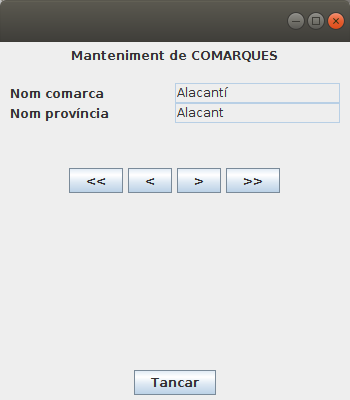

# 6 - JDBC avançat

JDBC disposa d’una alta funcionalitat i estructures que poden ajudar-nos a
incrementar la qualitat de les aplicacions que construïm.

La primera és poder accedir no a les dades, sinó a les estructures de les
dades, és a dir, l'estructura de les taules o de les consultes que fem: noms
de les columnes, tipus, etc. En definitiva és accedir a les Metadades.

També seria convenient construir aplicacions flexibles, robustes i eficients.
Necessitarem, doncs, un bon tractament d’errors que trasllade quan faça falta
la informació adequada a l’usuari o reconduint el flux de l’execució cap a
processos que interpreten i compensen els errors.

L’eficiència és també una característica important de la qualitat. En general,
els Sistemes Gestors de Bases de Dades disposen de mecanismes automàtics per
potenciar l’eficiència de les peticions, com ara l’ús de memòria caché d’accés
ràpid, la creació d’índexs automàtics, etc. Aquestos automatismes responen a
determinats patrons a l’hora de fer les peticions. Per això JDBC preveu altres
formes, diferents a les estudiades fins ara, per realitzar peticions que
milloren el rendiment.

## 6.1 - Accés a les Meta Dades

Normalment quan accedim a una Base de Dades des d'un programa Java, coneixerem
l'estructura d'aquesta Base de Dades, és a dir, les taules que té i cada taula
quins camps i de quin tipus són. I fins i tot les claus externes entre les
taules.

Però podria passar que no coneguérem aquesta estructura. Això no hauria de ser
un problema per accedir a la Base de Dades, ja que aquesta és autodescriptiva,
és a dir, que hem de poder consultar a la Base de Dades per a que ens diga la
seua estructura.

L'objecte que ens dóna aquesta informació és el **DatabaseMetaData**. Disposa
de molts mètodes que ens proporcionen gran quantitat d'informació.

I també ens dóna informació un altre objecte, **ResultSetMetaData** , que
obtindrà la informació a partir d'un **ResultSet**. Veurem els dos per
separat.

**<u>DatabaseMetaData</u>**


És l'adequat quan volem veure les taules i vistes que tenim en la Base de
Dades, així com l'estructura de cadascuna d'elles.

Mirem primer els mètodes més interessants que té:

**Valor tornat** | **Nom del mètode** | **Descripció**  
---|---|---  
String | **getDatabaseProductName()** | Torna el nom del SGBD  
String | **getDriverName()** | Torna el driver JDBC utilitzat  
String | **getURL()** | Torna la URL de la connexió   
String | **getUserName()** | Torna el nom de l'usuari que s'ha connectat 
ResultSet | **getTables(cataleg, esquema, nom, tipus)** | Torna informació de totes les taules que coincideixen <br>amb els patrons o criteris. Si posem null a tots els <br>paràmetres ens tornarà totes les taules i vistes  
ResultSet | **getColumns(cataleg, esquema, nom, nom_colu)** | Torna informació de les columnes de la taula <br>especificada en el tercer paràmetre (que està en el <br>catàleg i en l'esquema, si els posem). El quart<br> paràmetre servirà per a seleccionar les columnes <br>que coincidesquen amb el patró (null per a totes)  
ResultSet  | **getPrimaryKeys(cataleg, esquema, taula)** | Torna la llista de camps que formen la clau principal   
ResultSet | **getImportedKeys(cataleg, esquema, taula)** | Torna una llista amb les claus externes definides en <br>aquesta taula   
ResultSet | **getExportedKeys(cataleg, esquema, taula)** | Torna una llista amb les claus externes que apunten a<br> aquesta taula   
  
Per poder comprovar tot l'anterior, farem un programa que ens done informació
de la Base de Dades, una relació de les taules i vistes que té.
>
Posteriorment acceptarà un número, i traurà la informació de la taula
corresponent amb aquest format: columnes, tipus, clau principal, claus
externes.

Copieu elsegüent codi en un fitxer Kotlin anomenat
**Exemple_4_31_MetaData.kt** :

    
    
    package exemples
    
    import java.sql.DriverManager
    import java.io.BufferedReader
    import java.io.InputStreamReader
    
    fun main(args: Array<String>) {
        val con = DriverManager.getConnection ("jdbc:postgresql://89.36.214.106:5432/geo_ad", "geo_ad", "geo_ad")
    
        val dbmd = con.getMetaData ()
        println("Informació general")
        println("------------------")
        println("SGBD " + dbmd.getDatabaseProductName())
        println("Driver " + dbmd.getDriverName())
        println("URL " + dbmd.getURL())
        println("Usuari " + dbmd.getUserName())
        println()
        println("Llistat de taules")
        println(String.format("%-6s %-7s %-7s %-10s %-10s", "Número", "Catàleg", "Esquema", "Nom", "Tipus"))
        println("---------------------------------------------")
        val ll = dbmd.getTables(null, "public", null, null)
        var compt = 1
        val taules = ArrayList<String>()
        while (ll.next()) {
            println(String.format("%-6d %-7s %-7s %-10s %-10s",(compt++),ll.getString(1),ll.getString(2),ll.getString(3),ll.getString(4)))
            taules.add(ll.getString(3))
        }
        println()
        println("Introdueix un número per veure l'estructura de la taula (0 per acabar) ")
        val ent = BufferedReader(InputStreamReader (System.`in`))
        var opcio = Integer.parseInt(ent.readLine())
    
        while (opcio != 0) {
            if (opcio < compt && opcio > 0) {
                val taula = dbmd.getTables (null, "public", taules.get(opcio-1), null)
                if (taula.next()) {
                    if (taula.getString(4).equals("TABLE")) {
                        val rs = dbmd.getColumns (null, "public", taules.get(opcio-1), null)
                        println("Estructura de la taula " + taules.get(opcio - 1))
                        println("----------------------------")
                        while (rs.next())
                            println(rs.getString(4) + " (" + rs.getString(6) + ")")
                        println("----------------------------")
    
                        val rs2 = dbmd.getPrimaryKeys(null, "public", taules.get(opcio - 1))
                        print("Clau principal ")
                        while (rs2.next())
                            print(rs2.getString(4) + " ")
                        println()
    
                        val rs3 = dbmd.getImportedKeys(null, "public", taules.get(opcio - 1))
                        println("Claus externes ")
                        while (rs3.next()) {
                            println(rs3.getString(8) + " apunta a " + rs3.getString(3))
                        }
                        rs.close()
                        rs2.close()
                        rs3.close()
                    }
                }
                taula.close()
    
            }
            println()
            println("Introdueix un número per veure l'estructura de la taula (0 per acabar) ")
            opcio = Integer.parseInt(ent.readLine())
        }
        ll.close()
        con.close()
    }

**<u>ResultSetMetaData</u>**


Una vegada executada una sentència SELECT de SQL que ja tenim el resultat en
un ResultSet, podem accedir també a meta dades d'aquest ResultSet, obtenint
per exemple el número de columnes, o el tipus de les columnes. Ho obtenim per
mig del **ResulSetMetaData**.

Només veurem 3 mètodes

Valor tornat | Nom del mètode | Descripció  
---|---|---  
int | **getColumnCount()** | Torna el número de columnes del ResultSet  
String | **getColumnName(index)** | Torna el nom de la columna (la primera columna és la 1)  
String | **getColumnTypeName(index)** | Torna el tipus de la columna   
  
El següent exemple és una modificació del programa anterior, on ara traurem
tot el contingut d'una taula per mig de la sentència **SELECT * FROM
_taula_**. Intentarem donar-li un aspecte tabular, però sense patir molt per
l'aspecte.

Copieu el següent codi en un fitxer Kotlin anomenat
**Exemple_4_32_ResultSetMetaData.kt** :

    
    
    package exemples
    
    import java.sql.DriverManager
    import java.io.BufferedReader
    import java.io.InputStreamReader
    
    fun main(args: Array<String>) {
        val con = DriverManager.getConnection("jdbc:postgresql://89.36.214.106:5432/geo_ad", "geo_ad", "geo_ad")
    
        val dbmd = con.getMetaData()
        println("Llistat de taules:")
        println(String.format("%-6s %-7s %-7s %-10s %-10s", "Número", "Catàleg", "Esquema", "Nom", "Tipus"))
        println("---------------------------------------------")
        val ll = dbmd.getTables(null, "public", null, null)
        var compt = 1
        val taules = ArrayList<String>()
        while (ll.next()) {
            println(String.format("%-6d %-7s %-7s %-10s %-10s",(compt++),ll.getString(1),ll.getString(2),
                ll.getString(3),ll.getString(4)))
            taules.add(ll.getString(3))
        }
        println()
        println("Introdueix un número per veure el contingut de la taula (0 per acabar): ")
        val ent = BufferedReader(InputStreamReader(System.`in`))
        var opcio = Integer.parseInt(ent.readLine())
    
        while (opcio != 0) {
            if (opcio < compt && opcio > 0) {
                val taula = dbmd.getTables(null, "public", taules.get(opcio - 1), null)
                if (taula.next()) {
                    if (taula.getString(4).equals("TABLE")) {
                        val rs = con.createStatement().executeQuery("SELECT * FROM " + taules.get(opcio - 1) + " ORDER BY 1")
                        println("Contingut de la taula " + taules.get(opcio - 1))
                        println("----------------------------")
    
                        val rsmd = rs.getMetaData()
                        for (i in 1..rsmd.getColumnCount())
                            print(String.format("%-20.20s", rsmd.getColumnName(i)))
                        println()
                        println("------------------------------------------")
    
                        while (rs.next()) {
                            for (i in 1..rsmd.getColumnCount())
                                print(String.format("%-20.20s ", rs.getString(i)))
                            println()
                        }
                        rs.close()
                    }
                }
                taula.close()
            }
            println()
            println("Introdueix un número per veure el contingut de la taula (0 per acabar): ")
            opcio = Integer.parseInt(ent.readLine())
        }
        ll.close()
        con.close()
    }

## 6.2 - ResultSets que poden avançar cap avant i cap arrere

Fins el moment, tots els **ResultSet** que hem creat podien avançar únicament
cap avant, fent un recorregut seqüencial de les dades.

  * Inicialment el punter que apunta a l'estructura està situat abans de la primera fila
  * En fer **next()** se situa a la següent fila (la primera vegada se situa en la primera fila)
  * Quan estiguem situats en l'última fima, si fem next() se situara després de l'última, i ho indicarà tornant **false**

Però aquesta manera de funcionar, que es diu **TYPE_FORWARD_ONLY** i que és
l'opció per defecte per a obrir un ResultSet, no és l'única. Aquestos són els
tipus de ResultSet que hi ha:

  * **TYPE_FORWARD_ONLY** : és el tipus utilitzat fins el moment, i és el tipus per defecte. El ResultSet només pot avançar cap avant.
  * **TYPE_SCROLL_INSENSITIVE** : El ResultSet pot avançar cap avant i cap arrere, fins i tot pot anar a una posició absoluta (directament, sense passar per les anteriors). El ResultSet no és sensible als canvis fets en les dades que han proporcionat aquest resultat, és a dir, ens mostra les dades que hi havia en el moment d'executar la consulta, sense poder mostrar possibles canvis posteriors.
  * **TYPE_SCROLL_SENSITIVE** : Igual que l'anterior en quant al moviment. Però ara sí que és capaç de mostrar possibles canvies fets en les dades originals posteriors al moment de l'execució de la consulta, mentre el ResultSet estiga obert.

I per una altra banda el **ResultSet** pot tenir la possibilitat
d'**actualitzar** les dades originals. Des d'aquest punt de vista hi ha 2
possibles tipus:

  * **CONCUR_READ_ONLY** : El ResultSet només és de lectura i no es pot actualitzar
  * **CONCUR_UPDATABLE** : El ResultSet es pot actualitzar (i els canvis es reflectiran en les dades originals) utilitzant el mateix ResultSet

L'opció per defecte és **CONCUR_READ_ONLY**

Realment on declararem els tipus és en la creació del **STATEMENT** a partir
del qual crearem la sentència que omplirà el **ResultSet**. És lògic, ja que
aquestes maneres de funcionar s'han de preparar abans d'executar la sentència.
Fins ara no havíem posat paràmetres en la creació del **Statement** , cosa que
fa que es cree amb les opcions per defecte. Si volem altres opcions:
```
val st =con.createStatement(ResultSet.TYPE_SCROLL_INSENSITIVE,ResultSet.CONCUR_READ_ONLY)
```
```
val st =con.createStatement(ResultSet.TYPE_SCROLL_SENSITIVE,ResultSet.CONCUR_UPDATABLE)
```
La primera qüestió que hem de comentar és que el SGBD ha de ser capaç de
suportar els tipus que no són per defecte, i no sempre és així. Mentre que
**PostgreSQL** , **Oracle** i **MySQL** sí que són capaços de suportar tots
els tipus anteriors, **SQLite** no ho pot fer i tan sols suporta
**TYPE_FORWARD_ONLY** i **CONCUR_READ_ONLY** , com era d'esperar.

Deixant de banda la possibilitat de reflectir els possibles canvis de les
dades originals (**SENSITIVE**), i de poder actualitzar-les
(**CONCUR_UPDATABLE**), anem a estudiar els possibles moviments dins del
**ResultSet**.

  * **next** : Avança una fila cap avant. Torna _true_ si s'ha pogut posicionar, i _false_ si no s'ha pogut posicionar, per estar després de l'última fila.
  * **previous** : Avança una fila cap arrere. Torna _true_ si s'ha pogut posicionar, i _false_ si no s'ha pogut posicionar, per estar abans de la primera fila.
  * **first** : Se situa en la primera fila. Torna _true_ si s'ha pogut posicionar, i _false_ si no s'ha pogut posicionar, per no contenir el ResultSet cap fila.
  * **last:** : Se situa en l'última fila. Torna _true_ si s'ha pogut posicionar, i _false_ si no s'ha pogut posicionar, per no contenir el ResultSet cap fila.
  * **beforeFirst** : Se situa al principi del RecordSet, abans de la primera fila. Si no hi havia cap fila, no fa res.
  * **afterLast** : Se situa al final del RecordSet, després de l'última fila. Si no hi havia cap fila, no fa res.
  * **relative(int _files_)**: Meneja el cursor respecte de la posició actual, tantes files com s'indica en el paràmetre (si el paràmetre és negatiu, anirà cap arrere).
  * **absolute(int _fila_)**: Situa el cursor en la fila especificada en el paràmetre (1 és la primera)

El següent exemple es practica anar a la primera, a l'anterior, a la següent i
a l'última fila.

Copieu el següent codi en un fitxer Kotlin anomenat **Exemple_4_41_Scroll.kt**
:

    
    
    package exemples
    
    import javax.swing.JFrame
    import javax.swing.JLabel
    import javax.swing.JTextField
    import javax.swing.JButton
    import javax.swing.JPanel
    import java.awt.FlowLayout
    import java.awt.GridLayout
    import java.awt.BorderLayout
    import java.awt.EventQueue
    import java.sql.DriverManager
    import java.sql.ResultSet
    
    class Exemple_4_41_Scroll : JFrame() {
    
        val nomComarca = JTextField()
        val nomProvincia = JTextField()
    
        val primer = JButton("<<")
        val anterior = JButton("<")
        val seguent = JButton(">")
        val ultim = JButton(">>")
        val tancar = JButton("Tancar")
    
    
        val pDalt = JPanel(FlowLayout())
        val pCentre = JPanel(GridLayout(8, 0))
        val pDades = JPanel(GridLayout(2, 2))
        val pBotonsMov = JPanel(FlowLayout())
        val pTancar = JPanel(FlowLayout())
    
        val con = DriverManager.getConnection("jdbc:postgresql://89.36.214.106:5432/geo_ad", "geo_ad", "geo_ad")
        val st = con.createStatement(ResultSet.TYPE_SCROLL_INSENSITIVE, ResultSet.CONCUR_READ_ONLY)
        val rs = st.executeQuery("SELECT * FROM COMARCA ORDER BY 1")
    
        init {
            defaultCloseOperation = JFrame.EXIT_ON_CLOSE
    
            setBounds(100, 100, 350, 400)
            setLayout(BorderLayout())
    
            getContentPane().add(pCentre, BorderLayout.CENTER)
            getContentPane().add(JPanel(FlowLayout()), BorderLayout.WEST)
            getContentPane().add(JPanel(FlowLayout()), BorderLayout.EAST)
            getContentPane().add(pTancar, BorderLayout.SOUTH)
    
            pDalt.add(JLabel("Manteniment de COMARQUES"))
            pCentre.add(pDalt)
    
            pDades.add(JLabel("Nom comarca"))
            pDades.add(nomComarca)
            pDades.add(JLabel("Nom província"))
            pDades.add(nomProvincia)
            pCentre.add(pDades)
    
            nomComarca.setEditable(false)
            nomProvincia.setEditable(false)
    
            pCentre.add(JPanel(FlowLayout()))
    
            pBotonsMov.add(primer)
            pBotonsMov.add(anterior)
            pBotonsMov.add(seguent)
            pBotonsMov.add(ultim)
            pCentre.add(pBotonsMov)
    
            pTancar.add(tancar)
    
            rs.first()
            visComarca()
    
            primer.addActionListener {
                rs.first()
                visComarca()
            }
    
            anterior.addActionListener {
                if (!rs.isFirst())
                    rs.previous()
                visComarca()
            }
    
            seguent.addActionListener {
                if (!rs.isLast())
                    rs.next()
                visComarca()
            }
    
            ultim.addActionListener {
                rs.last()
                visComarca()
            }
    
            tancar.addActionListener{
                rs.close()
                st.close()
                con.close()
                System.exit(0)
            }
        }
    
        fun visComarca() {
            nomComarca.setText(rs.getString(1))
            nomProvincia.setText(rs.getString(2))
        }
    }
    
    fun main(args: Array<String>) {
        EventQueue.invokeLater({ Exemple_4_41_Scroll().isVisible = true })
    }

Aquest és el resultat:



## 6.3 - Tractament d'errors en aplicacions JDBC

L’execució de sentències SQL està sotmesa a molts de factors que poden
provocar algun error. Pot passar que la connexió falle, que el controlador no
siga l’adequat, que les sentències tinguen errades, que el SGBD no suporte la
sentència, i un llarg etcètera de possibilitats.


<u>**Nota**</u> 
<div style="background-color: #d6eaf8; color: black; padding: 5px;"> 
Podeu trobar informació referida als codis de <b>SQLSTATE</b> en la wikipedia, en
aquest <a href ="https://en.wikipedia.org/wiki/SQLSTATE"> enllaç</a>. El codi SQLSTATE està
format per cinc caràcters. Els dos primers indiquen la tipologia de l’error i
els tres últims el concreten.
</div>
<p></p>

Els errors SQL es troben molt ben definits a l’especificació estàndard, la
qual descriu el valor de la variable anomenada **SQLSTATE** , que identifica
l’estat d’una sentència SQL immediatament després de la seua execució. Quan
JDBC detecta que després d’una execució el valor d’aquesta variable es
correspon a un error, dispara una excepció de tipus **SQLException** la qual,
a més de contenir un missatge clarificador, incorpora el valor del
**SQLSATE**. Podem recuperar aquest valor amb el mètode **getSQLState()**.

L’ús de **_try-catch_** ens permetrà capturar específicament excepcions
**SQLException** o derivades. Una vegada capturades, utilitzarem el codi
SQLSTATE per decidir com cal actuar.

Un altre mètode molt útil és **getMessage()** que torna una cadena amb l'error
produït. Pot servir perfectament per a la resta d'errors no tractats, ja que
amb aquest missatge sempre donarem una pista, encara que no personalitzada com
abans.

Imaginem, per exemple, que en intentar connectar amb un SGBD capturem una
excepció SQL amb el valor **SQLState** igual a _28000_. Si consulteu aquest
codi a la pàgina que us indiquem en la nota de dalt veureu que el valor
_28000_ correspon a un error en l’autenticació. En canvi, si el codi rebut
haguera estat _08001_ significaria que JDBC està trobant problemes de xarxa a
l’hora de connectar, ja siguen deguts a una desconnexió física, o simplement a
un _host_ o adreça IP desconegut.

<u>**Nota**</u> 
<div style="background-color: #d6eaf8; color: black; padding: 5px;">   
PostgreSQL defineix millor l'error d'autenticació. En el cas de PostgreSQL és
el 28P01. Per tant hauríem de substituir per aquest valor en el programa
posterior si volem connectar a ell. La taula d'errors de PostgreSQL la podeu
trobar en aquest <a href ="https://www.postgresql.org/docs/current/static/errcodes-
appendix.html"> enllaç</a> 
</div>
<p></p>


No cal informar detalladament l’usuari de tots i cadascun dels possibles
errors, però sí que cal decidir quins errors requeriran un tractament
específic i quins no. Segurament no seria mala idea, si detectem un
**SQLState** de valor _08001_ , aconsellar l’usuari que abans de trucar al
servei tècnic revise les connexions de xarxa o s’assegure que el SGBD es troba
en marxa.

D’altra banda, la detecció precisa del **SQLState** ens pot també permetre
realitzar accions per reconduir l’error. Imaginem, per exemple, que per raons
de seguretat l’administrador del SGBD va canviant de contrasenya.
L’administrador tria una contrasenya a l’atzar d’entre un conjunt de tres o
quatre prefixades. Per tal de no haver d’estar contínuament configurant la
nostra aplicació cada vegada que canvie la contrasenya, podem implementar una
utilitat que accepte un conjunt de tres o quatre contrasenyes de manera que
puga anar provant d’una en una quan reba un error d’autenticació.

Per a la resta d'errors, podem avisar a l'usuari de l'error que s'ha produït,
o podem utilitzar una altra tècnica, que és utilitzar enregistradors. Els
enregistradors (_loggers_) van guardant automàticament en un fitxer les coses
que van succeint.

Vegem un possible exemple on posem en pràctica totes les consideracions que
acabem de comentar. Està fet sobre **MySQL** , ja que com hem comentat abans,
PostgreSQL utilitza ara un altre codi d'error per a la contrasenya invàlida.
Tindrem 3 contrasenyes possibles per a la connexió. Si qualsevol de les 3 és
bona, es connectarà. Sinó indicarà que hi ha un error en la contrasenya.

Copieu el següent codi en un fitxer Kotlin anomenat
**Exemple_4_51_TractamentErrors.kt** :

    
    
    package exemples
    
    import java.sql.Connection
    import java.sql.DriverManager
    import java.sql.SQLException
    
    fun main(args: Array<String>) {
    
        var connectat = false
        var con: Connection? = null
        println("tractamentErrorConnexio()")
    
        try {
    
            val url = "jdbc:postgresql://89.36.214.106:5432/geo_ad"
    
            val usuari = "geo_ad"
            val contrasenyes = arrayOf("geo0", "geo1", "geo_ad")
    
            for (i in 0 until contrasenyes.size) {
                try {
                    con = DriverManager.getConnection(url, usuari, contrasenyes[i])
                    connectat = true
                    break
                } catch (ex: SQLException) {
                    if (!ex.getSQLState().equals("28P01")) {
                        // NO és un error d'autenticació
                        throw ex
                    }
                }
            }
            if (connectat)
                println("Connexió efectuada correctament")
            else
                println("Error en la contrasenya")
        } catch (ex: SQLException) {
            if (ex.getSQLState().equals("08001")) {
                println(
                    "S'ha detectat un problema de connexió. Reviseu els cables de xarxa i assegureu-vos que el SGBD està operatiu."
                            + " Si continua sense connectar, aviseu el servei tècnic"
                )
    
            } else {
                println(
                    "S'ha produït un error inesperat. Truqueu al servei tècnic indicant el següent codi d'error SQL:"
                            + ex.getSQLState()
                )
            }
        } catch (ex: ClassNotFoundException) {
            println("No s'ha trobat el controlador JDBC (" + ex.message + "). Truqueu al servei tècnic")
        } finally {
            try {
                if (con != null && !con.isClosed()) {
                    con.close()
                }
            } catch (ex: SQLException) {
                throw ex
            }
        }
    }

## 6.4 - Transaccions

Una transacció és un conjunt de sentències SQL d'actualització (INSERT,
DELETE, UPDATE) que o bé s'executen totes o bé no s'executa ninguna.

La manera de confirmar les sentències és amb **COMMIT** , i la manera de
rebutjar-les totes és **ROLLBACK** (quedant l'estat com estava abans de
començar la transacció). En qualsevol dels dos casos, després d'executar les
sentències de control **COMMIT** o **ROLLBACK** , començarà una transacció
nova.

JDBC trasllada també aquest metodologia al seu API. Per defecte, les
connexions JDBC consideren que cada objecte **Statement** és en si mateix una
transacció. Abans de cada execució es demana l’inici d’una transacció i al
final, si l’execució té èxit, s’envia un **commit** i si no té èxit, un
**rollback**. Per això diem que la connexió actua en mode **autocommit**.

Però hi ha una altra manera de funcionar. Els **Statements** poden treballar
sense automatitzar el **commit** després de cada execució, canviant la
connexió de mode amb el mètode **setAutoCommit(false)**.

A partir d’aleshores es consideraran instruccions d’una mateixa transacció
totes les sentències executades entre dues cridades als mètodes **commit** o
**rollback**(equivalents JDBC de les instruccions **COMMIT** i **ROLLBACK** de
SQL).

A continuació tenim un programa en el qual fem una sèrie de canvis (una
modificació de files i un esborrat) però després fem un rollback, i per tant
no s'haurà fet cap de les actualitzacions. És sobre la Base de Dades de SQLite
**Empleats,sqlite** , que només tenia la taula EMPLEAT. Per a mostrar que
estem fent els canvis, però que després ls desfem amb **rollback** , mostrem
un resum en el qual senzillament indiquem el número d'empleat i el total dels
sous.

Prèviament ens guardem el estat que tenia l'**autocommit** , i després el
desactivem. Quan finalitza tot el procés posem autocommit com estava en un
principi.

Copieu el següent codi en un fitxer Kotlin anomenat
**Exemple_4_61_Transaccions.kt** :

    
    
    package exemples
    
    import java.sql.DriverManager
    import java.sql.Connection
    
    fun main(args: Array<String>) {
        val con = DriverManager.getConnection("jdbc:sqlite:Empleats.sqlite")
    
        resumEmpleats(con)			// estat inicial
    
        val autocommit = con.getAutoCommit()
        con.setAutoCommit(false)
        val st = con.createStatement()
        st.executeUpdate("UPDATE EMPLEAT SET sou = sou * 1.05")
        st.executeUpdate("DELETE FROM EMPLEAT WHERE depart=10")
    
        resumEmpleats(con)			// s'han modificat els sous i s'han esborrat dos empleats
    
        con.rollback()				// desfem els canvis
    
        resumEmpleats(con)			// hem tornat a l'estat inicial:
        // no s'ha fet ni l'actualització de sous ni l'esborrat d'empleats
    
        con.setAutoCommit(autocommit)
    
        con.close()
    }
    
    fun resumEmpleats(c: Connection) {  // En el resum traurem el número d'empleats i el total de sous
        val st = c.createStatement()
        val rs = st.executeQuery("SELECT COUNT(*), SUM(sou) FROM EMPLEAT")
        rs.next()
        println("Actualment hi ha " + rs.getInt(1) + " empleats que cobren un total de " + rs.getDouble(2) + " €")
        rs.close()
        st.close()
    }

La major part de SGBD permeten utilitzar transaccions explícites amb qualsevol
instrucció SQL, fins i tot alguns SGBD també en sentències DDL (_data
definition language_) com CREATE TABLE, etc . Les sentències de definició
modifiquen directament l’estructura de les dades i, per tant, cal anar molt en
compte perquè poden provocar danys importants, pèrdues de dades existents,
etc.

Però hi ha alguns SGBD com Oracle que no suporten la revocació de sentències
DDL i en cas d’executar **rollback** , obtindrem un error indicant que les
sentències DDL no es poden revocar.

## 6.5 - Millora de rendiment

Un altre aspecte important que mesura la qualitat de les aplicacions és
l’eficiència amb la qual s’aconsegueix comunicar amb el SGBD. Per optimitzar
la connexió és important reconèixer quins processos poden actuar de coll
d’ampolla.

En primer lloc, analitzarem la petició de connexió a un SGBD perquè es tracta
d’un procés costós però inevitable que cal considerar.

En segon lloc, estudiarem les sentències predefinides, perquè el seu ús
facilita la creació de _dades clau_ i índexs temporals de manera que siga
possible anticipar-se a la demanda o disposar de les dades de forma molt més
ràpida.

**<u>Temps de vida d'una connexió</u>**


L’establiment d’una connexió és un procediment molt lent, tant a la part
client com a la part servidor.

  * A la part client, **DriverManager** ha de descobrir el controlador correcte d’entre tots els que haja de gestionar. La majoria de vegades les aplicacions treballaran només amb un únic controlador, però cal tenir en compte que **DriverManager** no coneix a priori quina URL de connexió correspon a cada controlador, i per saber-ho envia una petició de connexió a cada controlador que tinga registrat, el controlador que no li retorna error serà el correcte.
  * A la banda servidor, es crearà un context específic i s’habilitaran un conjunt de recursos per cada client connectat. És a dir, que durant la petició de connexió el SGDB ha de gastar un temps considerable abans de deixar operativa la comunicació client-servidor.

Aquesta elevat cost de temps concentrat en el moment de la petició de connexió
fa que ens plantegem si val la pena obrir i tancar la connexió cada vegada que
ens toque executar una sentència SQL, o obrir una connexió al principi de
l'aplicació que tancaríem en finalitzar. Lamentablement no hi ha una única
resposta, sinó que depèn de la freqüència d’ús de la connexió i el número de
connexions contra el mateix SGBD.

Com en tot, es tracta de trobar el punt d’equilibri. Si el número de clients,
i per tant de connexions, és baix i la freqüència d’ús és alta, serà
preferible mantenir les connexions obertes molt de temps. Per contra, si el
número de connexions és molt alt i la freqüència d'ús baixa, el que serà
preferible serà obrir i tancar la connexió cada vegada que es necessite. I
també hi haurà una multitud de casos en què la solució consistirà a mantenir
les connexions obertes però no permanentment. Es pot donar un temps de vida a
cada connexió, o bé tancar-les després de restar inactiva una quantitat
determinada de temps, o es pot fer servir el criteri de mantenir un número
màxim de connexions obertes, tancant les més antigues o les més inactives quan
se sobrepasse el límit.

**<u>Sentències predefinides</u>**


JDBC disposa d’un objecte derivat del **Statement** que s’anomena
**PreparedStatement**., a la qual se li passa la sentència SQL en el moment de
crear-lo, no en el moment d'executar la sentència (com passava amb
**Statement**). I a més aquesta sentència pot admetre paràmetres, cosa que ens
pot anar molt bé en determinades ocasions.

Siga com siga, **PreparedStatement** presenta avantatges sobre el seu
antecessor **Statement** quan ens toque treballar amb sentències que s'hagen
d'executar diverses vegades. La raó és que qualsevol sentència SQL, quan
s’envia al SGBD serà compilada abans de ser executada.

  * Utilitzant un objecte **Statement** , cada vegada que fem una execució d’una sentència, ja siga via **executeUpdate** o bé via **executeQuery** , el SGBD la compilarà, ja que li arribarà en forma de cadena de caràcters.
  * En canvi, al **PreparedStament** la sentència mai varia i per tant es pot compilar i guardar dins del mateix objecte, de manera que les següents vegades que s’execute no caldrà compilar-la. Això reduirà sensiblement el temps d’execució.

En alguns sistemes gestors, a més, fer servir **PreparedStatements** pot
arribar a suposar més avantatges, ja que utilitzen la seqüència de bytes de la
sentència per detectar si es tracta d’una sentència nova o ja s’ha servit amb
anterioritat. D’aquesta manera es propicia que el sistema guarde les respostes
en la memòria caché, de manera que es puguen lliurar de forma més ràpida.

En el moment de programar, la principal diferència dels objectes
**PreparedStatement** en relació als **Statement** , és que en els últims la
sentència es passa com a paràmetre en el moment d'executar-lo, mentre que en
els primers se'ls passa la sentència SQL predefinida en el moment de crear-lo
(no d'executar-lo). Com que la sentència queda predefinida, ni els mètodes
**executeUpdate** ni **executeQuery** requeriran cap paràmetre. És a dir,
justet al revès que en el **Statement**.

Posem un exemple, en el qual demanem per teclat el nom d'una comarca i una
altura, per a traure els pobles de la comarca introduïda que estan a una
altura superior a l'altura introduïda.

Copieu el següent codi en un fitxer Kotlin anomenat
**Exemple_4_71_Statement.kt** :

    
    
    package exemples
    
    import java.sql.DriverManager
    import java.util.Scanner
    
    fun main(args: Array<String>) {
        val con = DriverManager.getConnection("jdbc:postgresql://89.36.214.106:5432/geo_ad", "geo_ad", "geo_ad")
    
        println("Introdueix una comarca:")
        val com = Scanner(System.`in`).nextLine()
        println("Introdueix una altura:")
        val alt = Scanner(System.`in`).nextInt()
    
        val st = con.createStatement()    // La sentència no va en el moment de la creació sinó en el d'execució
        val rs = st.executeQuery("SELECT nom,altura FROM POBLACIO WHERE nom_c='" + com + "' AND altura>" + alt)
        while (rs.next()) {
            println(rs.getString(1) + " (" +rs.getInt(2) + " m.)")
        }
        st.close()
        con.close()
    }

Observeu com per al cas del nom de la comarca, que és un String (o millor dit
un Varchar), en la sentència SQL hem de posar una cometa simple (') abans i
després del valor de la comarca, ja que és així com s'expressen els Varchar.
Resulta un poc incòmode.

Si utilitzem **PreparedStatement** , només haurem de canviar les línies 14 i
15.

Copieu el següent codi en un fitxer Kotlin anomenat
**Exemple_4_72_PreparedStatement.kt** , i observeu com només han canviat les
línies 14 i 15:

    
    
    package exemples
    
    import java.sql.DriverManager
    import java.util.Scanner
    
    fun main(args: Array<String>) {
        val con = DriverManager.getConnection("jdbc:postgresql://89.36.214.106:5432/geo_ad", "geo_ad", "geo_ad")
    
        println("Introdueix una comarca:")
        val com = Scanner(System.`in`).nextLine()
        println("Introdueix una altura:")
        val alt = Scanner(System.`in`).nextInt()
    
        val st = con.prepareStatement("SELECT nom,altura FROM POBLACIO WHERE nom_c='" + com + "' AND altura>" + alt)
        val rs = st.executeQuery()     // La sentència no va en el moment de l'execució sinó en el de creació
        while (rs.next()) {
            println(rs.getString(1) + " (" +rs.getInt(2) + " m.)")
        }
        st.close()
        con.close()
    }

Però anem un pas més enllà i anem a utilitzar paràmetres. La utilització de
paràmetres, a banda de la comoditat, en pot anar molt bé per a previndre
errors. Observeu com en els dos exemples anteriors teníem un problema si el
nom de la comarca conté una cometa simple (') com és en el cas per exemple de
la **Vall d'Albaida**. Si intentem posar aquesta comarca ens saltarà un error,
i és perquè interpretarà la cometa com el final de la cadena Varchar, i no
sabrà què és Albaida

    
```    
    SELECT nom,altura FROM POBLACIO WHERE nom_c='Vall d'Albaida' AND altura=500
```
La manera de solucionar-ho seria escapar la cometa, o doblar-la (vull dir 2
cometes simples, no doble cometa). Però també ens pot anar molt bé i molt
còmode utilitzar paràmetres, com veurem ara.

Els **paràmetres** de la sentència es marcaran amb el símbol d’interrogant (?)
i s’identificaran per la posició que ocupen a la sentència, començant a
comptar des de l’esquerra i a partir del número 1. El valor dels paràmetres
s’assignarà fent servir el mètode específic, d’acord amb el tipus de dades a
assignar. El nom d'aquestos mètodes començarà per **set** i continuarà amb el
nom del tipus de dades __(exemples:**setString()** , **setInt()** ,
**setLong()** , **setBoolean()** …). Tots aquestos mètodes segueixen la
mateixa sintaxi:
```
setXXXX(<posicioALaSentenciaSQL>, <valor>)
```
Veiem com quedaria el nostre exemple.

Copieu el següent codi en un fitxer Kotlin anomenat
**Exemple_4_73_PreparedStatement_ambParametres.kt** :

    
    
    package exemples
    
    import java.sql.DriverManager
    import java.util.Scanner
    
    fun main(args: Array<String>) {
        val con = DriverManager.getConnection("jdbc:postgresql://89.36.214.106:5432/geo_ad", "geo_ad", "geo_ad")
    
        println("Introdueix una comarca:")
        val com = Scanner(System.`in`).nextLine()
        println("Introdueix una altura:")
        val alt = Scanner(System.`in`).nextInt()
    
        val st = con.prepareStatement("SELECT nom,altura FROM POBLACIO WHERE nom_c=? AND altura>?")
        st.setString(1,com)				// Abans d'executar-la s'han d'iniciar els paràmetres
        st.setInt(2,alt)
        val rs = st.executeQuery()		// La sentència no va en el moment de l'execució sinó en el de creació
        while (rs.next()) {
            println(rs.getString(1) + " (" +rs.getInt(2) + " m.)")
        }
        st.close()
        con.close()
    }

Mireu com és més còmode, perquè en el moment de definir la sentència (quan
creem el PreparedStatement) per a el string no ens hem preocupat de posar la
cometa. Ni tampoc en el moment de definir el paràmetre en la línia següent.

I a més ara no fallarà quan posem la comarca **Vall d'Albaida**

Llicenciat sota la  [Llicència Creative Commons Reconeixement CompartirIgual
2.5](http://creativecommons.org/licenses/by-sa/2.5/)

