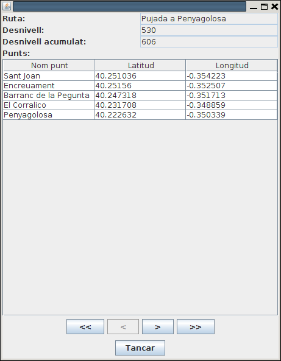

# Exercicis

Els següents exercicis, posa'ls tots en un paquet del projecte **Tema4**
anomenat **e****xercicis**

## Exercici 4_1

Crea un programa Kotlin anomenat **Ex4_1_CreaTaulesRuta.kt** que cree les
taules necessàries per a guardar les dades de les rutes en una Base de Dades
SQLite anomenada **Rutes.sqlite**.

Han de ser 2 taules:

  * **RUTES** : que contindrà tota la informació del conjunt de la ruta. La clau principal s'anomenarà **num_r** (entera). També guardarà el nom de la ruta (**nom_r**), desnivell ****(**desn**) i desnivell acumulat (**desn_ac**). Els tipus d'aquestos tres camps últims seran de text, enter i enter respectivament.
  * **PUNTS** : que contindrà la informació dels punts individuals de les rutes. Contindrà els camps **num_r** (número de ruta: enter) , **num_p** (número de punt: enter), **nom_p** (nom del punt: text) , **latitud** (número real) i **longitud** (número real). La clau principal serà la combinació **num_r + num_p** . Tindrà una **clau externa** (**num_r**) que apuntarà a la clau principal de **RUTES**.

Adjunta tot el projecte, i també la Base de Dades **Rutes.sqlite**(normalment
estarà dins del projecte)

## Exercici 4_2

Crea una altre programa anomenat **Ex4_2_****PassarRutesObjSQLite.kt** que
passe les dades del fitxer **Rutes.obj** a les taules de **Rutes.sqlite**.

Per a major comoditat copiat el fitxer **Rutes.obj** que vam fer al projecte
**Tema3** dins d'aquest projecte, a més de les classes **Coordenades.kt** ,
**PuntGeo.kt** i **Ruta.kt** dins del paquet. Si el paquet s'anomena igual en
els dos projectes (jo us havia suggerit **exercicis**) no hauria d'haver cap
problema.

Concretament en el trasvassament d'informació:

  * Per a cada **ruta** s'ha de considerar el **número de ruta** , que s'anirà incrementant, i a més serà la **clau principal**. La primera ruta ha de ser la número 1. A banda han d'anar la resta de camps.
  * Per a cada **punt** s'ha de guardar el **número de ruta** i el **número de punt** (s'anirà incrementant des de 1 per a cada ruta). A banda han d'anar la resta de camps.
  * T'aconselle vivament que abans d'executar les sentències SQL d'inserció, les tragues per pantalla, per veure si la sintaxi és correcta. Quan totes siguen correctes, pots substituir l'eixida per l'execució de les sentències.

Adjunta tot el projecte, i també la Base de Dades **Rutes.sqlite** , que
normalment estarà situada dins del projecte

## Exercici 4_3

Crea un programa anomenat **Ex4_3_****VisRutes_SQLite.kt** , que mostre les
rutes amb un aspecte similar a l'**Exercici 3_4** , però accedint ara a les
dades guardades en **Rutes.sqlite** :

  
---  
  
Podríem mantenir la connexió fins que s'aprete el botó d'**Eixir** , que és
quan la tancaríem.

Ací teniu l'esquelet del programa.

    
    
    import javax.swing.JFrame
    import java.awt.EventQueue
    import java.awt.BorderLayout
    import javax.swing.JPanel
    import java.awt.FlowLayout
    import javax.swing.JComboBox
    import javax.swing.JButton
    import javax.swing.JTextArea
    import javax.swing.JLabel
    
    class Finestra : JFrame() {
    
    	init {
    		// Sentències per a fer la connexió
    		
    		defaultCloseOperation = JFrame.EXIT_ON_CLOSE
    		setTitle("JDBC: Visualitzar Rutes")
    		setSize(450, 450)
    		setLayout(BorderLayout())
    
    		val panell1 = JPanel(FlowLayout())
    		val panell2 = JPanel(BorderLayout())
    		add(panell1, BorderLayout.NORTH)
    		add(panell2, BorderLayout.CENTER)
    
    		val llistaRutes = arrayListOf<String>()
    		// Sentències per a omplir l'ArrayList amb el nom de les rutes
    
    
    		val combo = JComboBox<String>(llistaRutes.toTypedArray())
    		panell1.add(combo)
    		val eixir = JButton("Eixir")
    		panell1.add(eixir)
    		val area = JTextArea()
    		panell2.add(JLabel("Llista de punts de la ruta:"),BorderLayout.NORTH)
    		panell2.add(area,BorderLayout.CENTER)
    
    
    		combo.addActionListener() {
    			// Sentèncis quan s'ha seleccionat un element del JComboBox
    			// Han de consistir en omplir el JTextArea
    			
    		}
    		
    		eixir.addActionListener(){
    			// Sentències per a tancar la connexió i eixir
    			
    		}
    	}
    }
    
    fun main(args: Array<String>) {
    	EventQueue.invokeLater {
    		Finestra().isVisible = true
    	}
    }

## Exercici 4_4

En aquest exercici anem a practicar la creació d'una classe que encapsule
pràcticament tot el tractament de la Base de Dades, per a fer transparent el
desfasament Objecte-Relacional. Per tant aquesta classe ha de ser capaç de
llegir de les taules convertint a objectes, i també guardar la informació dels
objectes en les taules. S'anomenarà **GestionarRutesBD****.**

En un paquet nou del mateix projecte, anomenat **util.bd** haureu de fer la
classe **GestionarRutesBD** , que és la que encapsularà tot. Internament només
tindrà **una propietat** , la de **connexió**. Tindrà els següents mètodes:

  * El constructor de **GestionarRutesBD** : establirà la connexió amb la Base de Dades **Rutes.sqlite** (per comoditat en el directori del projecte). Si no existeixen les taules **RUTES** i **PUNTS** les haurà de crear (podeu utilitzar la sentència **CREATE TABLE IF NOT EXISTS** ...)
  * **fun close()** : tancarà la connexió.
  * **fun inserir(r: Ruta)** : Inserirà en la BD les dades corresponents a la ruta passada per paràmetre (inicialment s'aconsella únicament "imprimir" les sentències, per veure si són correctes). El **num_r** ha de ser el posterior a l'última existent, per exemple amb la consulta **SELECT MAX(num_r) FROM RUTES**
  * **fun buscar(i: Int): Ruta** : torna la ruta amb el número passat com a paràmetre.
  * ****fun llistat(): ArrayList <Ruta>****: torna un ArrayList de Ruta amb totes les rutes de la Base de Dades.
  * **fun esborrar(i: Int)** : esborra la ruta amb el número passat com a paràmetre (recordeu que els punts de la ruta també s'han d'esborrar)

Per a provar-lo podeu incorporar l'executable **UtilitzarRutesBD.kt**. Hauríeu
de comentar les línies que no s'utilitzen en cada moment. Per exemple, si ja
heu aconseguit inserir la ruta, i continueu provant el programa per als
mètodes **buscar()** i **llistat()** , comenteu la línia **gRutes.inserir(r)**
per a no inserir-la més vegades.

    
    
    fun main(args: Array<String>) {
    	// Creació del gestionador
    	val gRutes = GestionarRutesBD()
    	
    	// Inserció d'una nova Ruta
    	val noms = arrayOf( "Les Useres", "Les Torrocelles", "Lloma Bernat", "Xodos (Molí)", "El Marinet", "Sant Joan")
    	val latituds = arrayOf(40.158126, 40.196046, 40.219210, 40.248003, 40.250977, 40.251221)
    	val longituds = arrayOf(-0.166962, -0.227611, -0.263560, -0.296690, -0.316947, -0.354052)
    	
    	val punts = arrayListOf<PuntGeo>()
    	for (i in 0 until 6){
    		punts.add(PuntGeo(noms[i], Coordenades(latituds[i], longituds[i])))
    	}
    
    	gRutes.inserir(Ruta("Pelegrins de Les Useres",896,1738,punts))
    
    	// Llistat de totes les rutes
    	for (r in gRutes.llistat())
    		r?.mostrarRuta()
    
    	// Buscar una ruta determinada
    	val r2 = gRutes.buscar(2)
    	if (r2 != null)
    		r2.mostrarRuta()
    
    	gRutes.close()
    }

## Exercici 4_5 (voluntari)

Crea el segünet mètode en la classe **GestionarRutesBD** :

**fun guardar(r: Ruta)**

El que ha de fer aquest mètode és:

  * Si no existeix la ruta, la inserirem
  * Si ja existeix la ruta, la modificarem. Heu de parar especial atenció als punts. Potser el més còmode siga esborrar els punts de la ruta i tornar a crear-los

Considerarem que la ruta existeix si hi ha una amb el mateix nom.

Per a provar-lo, podeu utilitzar aquest programa principal guardant el codi en
un fitxer Kotlin anomenat **UtilitzarRutesBD2.kt** :

    
    
    fun main(args: Array<String>) {
    	// Creació del gestionador
    	val gRutes = GestionarRutesBD()
    
    	var r = gRutes.buscar(1) as Ruta
    	r.mostrarRuta()
    	r.desnivellAcumulat=606
    	gRutes.guardar(r)
    
    	r = gRutes.buscar(2) as Ruta
    	r.mostrarRuta()
    	r.llistaDePunts.add(0, PuntGeo ("Plaça M.Agustina", Coordenades(39.988507, -0.034533)))
    	gRutes.guardar(r)
    
    	println("Després de modificar")
    	r = gRutes.buscar(1) as Ruta
    	r.mostrarRuta()
    	r = gRutes.buscar(2) as Ruta
    	r.mostrarRuta()
    
    	gRutes.close()
    }

## Exercici 4_6 (voluntari)

Anem a fer molt més completa i atractiva l'aplicació gràfica de les rutes. Ens
aprofitarem del construït en els exercicis 4.4 i 4.5, és a dir, la classe
**GestionarRutesBD** , que encapsulava pràcticament l'accés a la BD, de manera
que nosaltres obtenim (i guardem) objectes.

El programa mostrarà una ruta, i hi haurà també uns botons per anar a la
primera, anterior, següent i última ruta. Hi ha també el botó de Tancar, que
tancarà l'objecte GestionarRutesBD i eixirà del programa.

Per a omplir el JTable amb els punts, teniu un mètode que ho fa
automàticament: **plenarTaula()**. Observeu quin és el seu paràmetre.

Aquest seria el seu aspecte:

Aquest seria l'esquelet del programa.

Copieu-lo en un fitxer Kotlin anomenat **Ex4_6_VisRutes_SQLite_Complet.kt** en
el mateix paquet **util.bd** , i poseu les sentències necessàries després dels
comentaris:

    
    
    import java.awt.EventQueue
    import java.awt.GridLayout
    import java.awt.FlowLayout
    import javax.swing.JFrame
    import javax.swing.JPanel
    import javax.swing.BoxLayout
    import javax.swing.JButton
    import javax.swing.JLabel
    import javax.swing.JTextField
    import javax.swing.JTable
    import javax.swing.JScrollPane
    
    class FinestraComplet : JFrame() {
        val gRutes = GestionarRutesBD()
        var llista = arrayListOf<Ruta>()
        var numActual = 0
    
        val qNom = JTextField(15)
        val qDesn = JTextField(5)
        val qDesnAcum = JTextField(5)
        val punts = JTable(1,3)
        val primer = JButton(" << ")
        val anterior = JButton(" < ")
        val seguent = JButton(" > ")
        val ultim = JButton(" >> ")
        val tancar = JButton("Tancar")
        init {
            defaultCloseOperation = JFrame.EXIT_ON_CLOSE
            setTitle("JDBC: Visualitzar Rutes Complet")
            setLayout(GridLayout(0,1))
    
            val p_prin = JPanel()
            p_prin.setLayout(BoxLayout(p_prin, BoxLayout.Y_AXIS))
            val panell1 = JPanel(GridLayout(0,2))
            panell1.add(JLabel("Ruta:"))
            qNom.setEditable(false)
            panell1.add(qNom)
            panell1.add(JLabel("Desnivell:"))
            qDesn.setEditable(false)
            panell1.add(qDesn)
            panell1.add(JLabel("Desnivell acumulat:"))
            qDesnAcum.setEditable(false)
            panell1.add(qDesnAcum)
            panell1.add(JLabel("Punts:"))
    
            val panell2 = JPanel(GridLayout(0,1))
            punts.setEnabled(false)
            val scroll = JScrollPane(punts)
            panell2.add(scroll, null)
    
            val panell5 = JPanel(FlowLayout())
            panell5.add(primer)
            panell5.add(anterior)
            panell5.add(seguent)
            panell5.add(ultim)
    
            val panell6 = JPanel(FlowLayout())
            panell6.add(tancar)
    
            add(p_prin)
            p_prin.add(panell1)
            p_prin.add(panell2)
            p_prin.add(panell5)
            p_prin.add(panell6)
            pack()
    
            primer.addActionListener{
                // instruccions per a situar-se en la primera ruta, i visualitzar-la
            }
            anterior.addActionListener{
                // instruccions per a situar-se en la ruta anterior, i visualitzar-la
            }
            seguent.addActionListener{
                // instruccions per a situar-se en la ruta següent, i visualitzar-la
            }
            ultim.addActionListener{
                // instruccions per a situar-se en l'última ruta, i visualitzar-la
            }
            tancar.addActionListener{
            }
    
            inicialitzar()
            VisRuta()
        }
    
        fun plenarTaula(ll_punts: MutableList<PuntGeo>){
            var ll = Array(ll_punts.size) { arrayOfNulls<String>(3) }
            for (i in 0 until ll_punts.size){
                ll[i][0]=ll_punts.get(i).nom
                ll[i][1]=ll_punts.get(i).coord.latitud.toString()
                ll[i][2]=ll_punts.get(i).coord.longitud.toString()
            }
            val caps = arrayOf("Nom punt","Latitud","Longitud")
            punts.setModel(javax.swing.table.DefaultTableModel(ll,caps))
        }
    
        fun inicialitzar() {
            // instruccions per a inicialitzar llista i numActual
    
        }
    
        fun VisRuta(){
            // instruccions per a visualitzar la ruta actual (l'índex el tenim en numActual)
    
            ActivarBotons()
        }
    
        fun ActivarBotons(){
            // instruccions per a activar o desactivar els botons de moviment ( isEnabled )
    
        }
    
    }
    
    fun main(args: Array<String>) {
        EventQueue.invokeLater {
            FinestraComplet().isVisible = true
        }
    }

  
``

## Exercici 4_7 (ampliació - voluntari)

Modifica l'aplicació anterior per a que es puguen modificar, esborrar i
inserir les rutes.

  * S'haurien de posar més botons: **Editar** , **Eliminar** i **Nova Ruta**.
  * Estaria bé que en entrar a qualsevol de les opcions anteriors es desactivaren els botons de navegació, que desaparegueren els d'Editar, Eliminar i Nova Ruta, i que aparegueren els d'**Acceptar** i **Cancel·lar**.
  * En tots els casos, si es cancel·la no es fa cap acció, però s'ha de tornar a l'estat anterior (primera imatge)
  * **EDITAR** : 
    * S'han d'"activar" els controls per a poder modificar les dades.
    * En cas d'acceptar s'ha de fer la modificació a partir del contingut de tots els controls (no cal detectar quins s'han modificat)
    * En cas de cancel·lar, no es fa la modificació, i senzillament s'ha de tornar a visualitzar la ruta actual (com no s'ha fet cap canvi, apareixeran les dades anteriors)
    * Per a afegir nous punts, es podria posar un botó per a afegir una nova línia al JTable, i un altre per a llevar una línia

  * **ELIMINAR** : 
    * Si s'accepta, s'haurà d'esborrar la ruta, sinó tornar a visualitzar-la

  * **INSERIR** : 
    * Haurà de mostrar tots els camps en blanc, i evidentment activats, per a poder introduir dades.
    * En cas d'acceptar s'ha d'introduir la nova ruta.
    * En cas de cancel·lar, estaria bé tornar a la que s'estava mostrant abans d'apretar el botó de nova ruta.
    * Per a introduir nous punts, es podria posar un botó per a afegir una nova línia al JTable, i un altre per a llevar una línia

**Nota**

EL JTable de vegades és engorrós. Si s'està editant una casella, la informació
no s'ha introduït encara, fins que no s'aprete enter, tab o amb el ratolí no
s'aprete a algun altre lloc. Per a acabar la introducció de la informació que
s'està editant, es podria executar el següent (per exemple quan s'ha apretat
**Acceptar**):

    
    
    				if (punts.isEditing())
    					punts.getCellEditor().stopCellEditing()
    

on **punts** seria el JTable.

Aquest seria l'esquelet del programa, que el podríeu guardar en el fitxer
**Ex4_7_VisRutes_SQLite_Avançat.kt** en el mateix paquet**util.bd** ,on hem
posat 2 mètodes que poden anar bé per a activar i visualitzar uns botons o
altres. I també activar els JTextField i el JTable.

    
    
    package util.bd
    
    import java.awt.EventQueue
    import java.awt.GridLayout
    import java.awt.FlowLayout
    import javax.swing.JFrame
    import javax.swing.JPanel
    import javax.swing.BoxLayout
    import javax.swing.JButton
    import javax.swing.JLabel
    import javax.swing.JTextField
    import javax.swing.JTable
    import javax.swing.JScrollPane
    
    import javax.swing.table.DefaultTableModel
    
    class FinestraAvancat : JFrame() {
        val gRutes = GestionarRutesBD()
        var llista = arrayListOf<Ruta>()
        var numActual = 0
        var actualitzant = false
        var modificacio = ""
    
        val qNom = JTextField(15)
        val qDesn = JTextField(5)
        val qDesnAcum = JTextField(5)
        val punts = JTable(1, 3)
        val primer = JButton(" << ")
        val anterior = JButton(" < ")
        val seguent = JButton(" > ")
        val ultim = JButton(" >> ")
        val tancar = JButton("Tancar")
    
        val editar = JButton("Editar")
        val eliminar = JButton("Eliminar")
        val nova = JButton("Nova Ruta")
    
        val acceptar = JButton("Acceptar")
        val cancelar = JButton("Cancel·lar")
        val mesP = JButton("+p")
        val menysP = JButton("-p")
    
        init {
            defaultCloseOperation = JFrame.EXIT_ON_CLOSE
            setTitle("JDBC: Visualitzar Rutes Avançat")
            setLayout(GridLayout(0, 1))
    
            val p_prin = JPanel()
            p_prin.setLayout(BoxLayout(p_prin, BoxLayout.Y_AXIS))
            val panell1 = JPanel(GridLayout(0, 2))
            panell1.add(JLabel("Ruta:"))
            qNom.setEditable(false)
            panell1.add(qNom)
            panell1.add(JLabel("Desnivell:"))
            qDesn.setEditable(false)
            panell1.add(qDesn)
            panell1.add(JLabel("Desnivell acumulat:"))
            qDesnAcum.setEditable(false)
            panell1.add(qDesnAcum)
            panell1.add(JLabel("Punts:"))
    
            val panell2 = JPanel(GridLayout(0, 1))
            punts.setEnabled(false)
            val scroll = JScrollPane(punts)
            panell2.add(scroll, null)
    
            val panell5 = JPanel(FlowLayout())
            panell5.add(primer)
            panell5.add(anterior)
            panell5.add(seguent)
            panell5.add(ultim)
            panell5.add(editar)
            panell5.add(eliminar)
            panell5.add(nova)
    
            acceptar.setVisible(false)
            panell5.add(acceptar)
            cancelar.setVisible(false)
            panell5.add(cancelar)
            mesP.setVisible(false)
            panell5.add(mesP)
            menysP.setVisible(false)
            panell5.add(menysP)
    
            val panell6 = JPanel(FlowLayout())
            panell6.add(tancar)
    
            add(p_prin)
            p_prin.add(panell1)
            p_prin.add(panell2)
            p_prin.add(panell5)
            p_prin.add(panell6)
            ActivarAltres(true)
            pack()
            ActivarAltres(false)
    
            primer.addActionListener{
                // instruccions per a situar-se en la primera ruta, i visualitzar-la
            }
            anterior.addActionListener{
                // instruccions per a situar-se en la ruta anterior, i visualitzar-la
            }
            seguent.addActionListener{
                // instruccions per a situar-se en la ruta següent, i visualitzar-la
            }
            ultim.addActionListener{
                // instruccions per a situar-se en l'últim ruta, i visualitzar-la
            }
            tancar.addActionListener{
            }
    
            editar.addActionListener {
                // instruccions per a editar la ruta que s'està veient en aquest moment
                // s'han d'activar els quadres de text, i el JTable
            }
    
            eliminar.addActionListener {
                // instruccions per a eliminar la ruta que s'està veient en aquest moment
            }
    
            nova.addActionListener {
                // instruccions per a posar en blanc els quadres de text i el JTable, per a inserir una nova ruta
                // s'han d'activar els quadres de text, i el JTable
            }
    
            acceptar.addActionListener {
                // instruccions per a acceptar l'acció que s'està fent (nova ruta, edició o eliminació)
            }
    
            cancelar.addActionListener {
                // instruccions per a cancel·lar l'acció que s'estava fent
            }
    
            mesP.addActionListener {
                // instruccions per a afegir una línia en el JTable
                // S'ha de fer sobre el DefaultTableModel
            }
    
            menysP.addActionListener {
                // instruccions per a llevar una línia del JTable
                // S'ha de fer sobre el DefaultTableModel
            }
    
            inicialitzar()
            VisRuta()
        }
    
        fun plenarTaula(ll_punts: MutableList<PuntGeo>) {
            var ll = Array(ll_punts.size) { arrayOfNulls<String>(3) }
            for (i in 0 until ll_punts.size) {
                ll[i][0] = ll_punts.get(i).nom
                ll[i][1] = ll_punts.get(i).coord.latitud.toString()
                ll[i][2] = ll_punts.get(i).coord.longitud.toString()
            }
            val caps = arrayOf("Nom punt", "Latitud", "Longitud")
            punts.setModel(javax.swing.table.DefaultTableModel(ll, caps))
        }
    
        fun inicialitzar() {
            // instruccions per a iniialitzar llista i numActual
        }
    
        fun VisRuta(){
            // instruccions per a visualitzar la ruta actual (l'índex el tenim en numActual)
    
            ActivarBotons()
        }
    
        fun ActivarBotons(){
            // instruccions per a activar o desactivar els botons de moviment ( setEnabled(Boolean) )
        }
    
        fun ActivarAltres(b: Boolean) {
            // instruccions per a mostrar els botons acceptar, cancelar, mesP, menysP,
            // ocultar editar, eliminar, nova. O al revés
            // I descativar els de moviment
        }
    
        fun ActivarQuadres(b: Boolean) {
            // instruccions per a fer editables els JTextFiels i el JTable
        }
    
        fun PosarQuadresBlanc() {
            // instruccions per a deixar els controls en blanc per a inserir una nova ruta
        }
    
        fun IniRuta(): Ruta {
            // instruccions per a tornar una Ruta a partir de les dades dels controls
        }
    }
    
    fun main(args: Array<String>) {
        EventQueue.invokeLater {
            FinestraAvancat().isVisible = true
        }
    }

Llicenciat sota la  [Llicència Creative Commons Reconeixement CompartirIgual
2.5](http://creativecommons.org/licenses/by-sa/2.5/)

